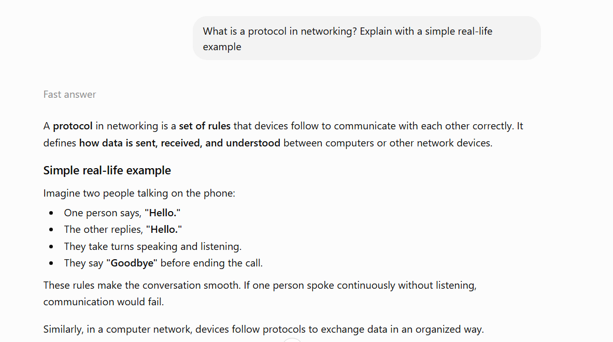
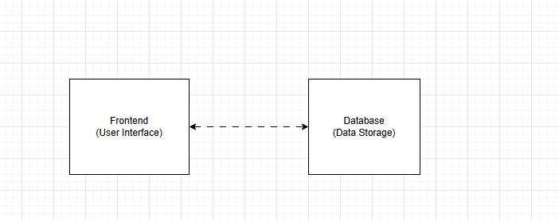
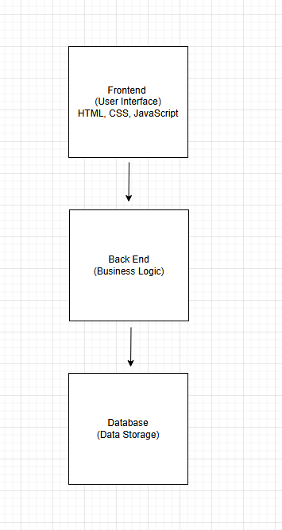
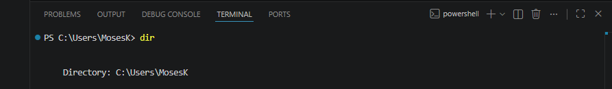

# Week 00 - Internet and Networking

Part of the DevOps Micro Internship (DMI) Cohort 3 with Agentic AI

---

# 🧑‍💻 Task 1: Using ChatGPT as Your Learning Assistant

## Scenario

You're new to DevOps and will frequently encounter technical questions. ChatGPT can be your learning companion.

## Your Task

Write a clear ChatGPT prompt to help you understand:

> "What is a protocol in networking? Explain with a simple real-life example."

Take a screenshot of your interaction showing:

* Your detailed prompt (with clear expectations)
* ChatGPT's simplified response with an example

## Screenshot

Save your screenshot in the `screenshots` folder and update the file name below.




Replace `task-1-chatgpt.png` with your actual screenshot file name.

---

## What I Learned (2–3 lines)

I learned that a network protocol is a set of rules that allows devices to communicate with each other correctly. I also learned that protocols such as HTTP, HTTPS, and TCP/IP ensure data is transferred accurately and efficiently over a network.

---

# 🌐 Task 2: Internet and Networking

## Scenario

Your friend is launching an online bookstore named **EpicReads**.

He asked you to explain how users globally can access his website hosted in Finland.

## Your Task

Write a short explanation (**100–150 words**) that includes:

* Packet Switching
* IP Address
* TCP/IP
* HTTP/HTTPS

💡 **Tip:** You may use ChatGPT (as demonstrated in Task 1) to refine your explanation.

## Answer

EpicReads' website is hosted on a server in Finland, but readers from anywhere in the world can access it through the Internet. When a user visits the website, their browser sends a request using HTTP or HTTPS (the secure version of HTTP). The request is broken into small pieces called packets using packet switching, allowing the data to travel efficiently through different network paths. Each packet contains the IP address of the destination server in Finland, so routers know where to send it. The TCP/IP protocol ensures that all packets are delivered correctly, in the right order, and without errors. Once the packets reach the server, it sends the requested webpage back to the user's device, where the packets are reassembled and the EpicReads website is displayed.

---

# 🏗️ Task 3: Application Architecture & Stack

## Scenario

EpicReads bookstore has two application versions:

### Two-Tier Application

* Frontend
* Database

### Three-Tier Application

* Frontend
* Backend
* Database

## Your Task

* Draw simple diagrams (hand-drawn or tool-based such as draw.io)
* Label each layer clearly
* List at least two common technologies or tools used for each layer
* Submit a screenshot or photo clearly showing your own drawing

## Diagram Screenshot / Photo

Save your diagram image in the `screenshots` folder and update the file name below.





Replace `task-3-diagram.png` with your actual diagram file name.

---

## Technologies Used

### Frontend

* HTML
* CSS

### Backend

* Node.js /Express.js
* Java (Spring boot)

### Database

* MySQL/PostgreSQL
* Microsoft SQL Server

---

# 🌍 Task 4: Domain Name & DNS (Basic Concepts)

## Scenario

Your friend's bookstore **EpicReads** is currently accessible through:

```text
52.172.142.222:3000
```

He purchased the domain:

```text
epicreads.com
```

## Your Task

In **50–100 words**, explain in your own words:

1. What is DNS (Domain Name System)?
2. Which DNS record type should be used to connect the domain to the given IP, and why?

## Answer

DNS (Domain Name System) is a system that translates human-friendly domain names like epicreads.com into IP addresses that computers use to find websites and services. To connect the domain to the given IP address 52.172.142.222, an A record should be created because it maps a domain name to an IPv4 address. The port number 3000 is not included in the DNS record and must be handled by the server or application configuration.

---

# 💻 Task 5: Visual Studio Code Setup (Hands-on)

## Your Task

Install Visual Studio Code (if not already installed).

Take a screenshot of your VS Code environment showing:

* Terminal open inside VS Code
* Running a basic command:

### Windows

```powershell
dir
```

### Linux / macOS

```bash
pwd
ls
```

* Your selected VS Code theme clearly visible

⚠️ **Important:** The screenshot must show your username or another identifiable detail to confirm it is your environment.

## Screenshot

Save your screenshot in the `screenshots` folder and update the file name below.




Replace `task-5-vscode.png` with your actual screenshot file name.

---

# 🔗 Task 6: Publish Your Assignment as a LinkedIn Post

## Objective

Publishing on LinkedIn helps you:

* Build your professional online presence
* Reinforce your learning
* Document your DevOps journey publicly

## Your Task

Summarize your answers from Tasks 1–5 into a LinkedIn post.

Clearly structure your post into the following sections:

* ChatGPT
* Internet & Networking
* App Architecture
* DNS
* VS Code Setup

Add the following credit note at the end of your post:

> **P.S. This post is part of the DevOps Micro Internship (DMI) with Agentic AI — Cohort 3 — by Pravin Mishra. My graded progress is public: https://dmi.pravinmishra.com/s/YOUR-GITHUB-USERNAME.html · Start your DevOps journey: https://dmi.pravinmishra.com/?utm_source=student&utm_medium=ps-linkedin&utm_campaign=cohort3**

---

## LinkedIn Post URL

Paste your LinkedIn post URL here:

```text
https://www.linkedin.com/posts/moses-avoseh_over-the-past-few-days-ive-been-exploring-ugcPost-7458218705928302593-I-xP/?utm_source=share&utm_medium=member_desktop&rcm=ACoAACZiz20BSL2chCMaU_0WK_2_7qktttgciMQ
```

---

## LinkedIn Post Backup Copy

Paste the full text of your LinkedIn post here:

Over the past few days, I’ve been exploring some core concepts that power the internet and modern applications. Here’s a quick breakdown of what I’ve learned:

I explored how tools like ChatGPT can simplify learning and problem-solving. It acts like a smart assistant, helping with explanations, coding, and even structuring ideas more clearly.

I learned how data travels across the internet using concepts like packet switching, IP addresses, and protocols such as TCP/IP and HTTP/HTTPS. These work together to ensure information is sent, received, and displayed correctly when we browse websites.


I understood the difference between 2-tier and 3-tier applications.

2-tier: Frontend communicates directly with the database
3-tier: Frontend → Backend → Database (more secure and scalable)
This structure is key when designing real-world applications.


DNS acts like the internet’s phonebook—translating domain names into IP addresses. For example, connecting epicreads.com to a server IP requires an A record, which maps the domain directly to the server.

I also set up my development environment using Visual Studio Code, installing useful extensions and configuring it for efficient coding and project management.

These foundational concepts are helping me better understand how systems are built and how the internet truly works behind the scenes. Excited to keep learning and building!

P.S. This post is part of the FREE DevOps Micro Internship Cohort run by Pravin Mishra. You can start your DevOps journey for free from his YouTube Playlist.

---

# Reflection – Week 0

### What did you find easy?

I found understanding basic internet concepts like DNS, IP addresses, and application architecture relatively easy. Learning how DNS maps domain names to IP addresses using records like A records was straightforward. I also found exploring 2-tier and 3-tier applications helpful because the differences between direct database communication and using a backend layer were clear.

---

### What was difficult?

Understanding how different internet concepts work together behind the scenes was challenging. Concepts like packet switching, TCP/IP, and HTTP/HTTPS required more attention because they involve multiple processes working together to deliver data correctly. Setting up and configuring the development environment also took some time to understand.

---

### What will you improve next week?

Next week, I want to improve my practical understanding by applying these concepts through hands-on projects. I will focus on learning more about DevOps tools, improving my coding workflow in Visual Studio Code, and gaining a deeper understanding of how applications are deployed and managed in real-world environments.

---

## 📌 About DMI & CloudAdvisory

DevOps Micro Internship (DMI) is a project-based DevOps program run by Pravin Mishra (The CloudAdvisory) focused on real-world execution, systems thinking, and career readiness.

It helps learners build strong DevOps foundations with hands-on experience.


## 📌 Resources

- 🌐 **DMI Official Website:** https://pravinmishra.com/dmi  
- 🎓 **DevOps for Beginners (Udemy):** https://www.udemy.com/course/devops-for-beginners-docker-k8s-cloud-cicd-4-projects/  
- 🎓 **Ultimate Agentic AI DevOps with Clude Code** https://www.udemy.com/course/ultimate-agentic-ai-devops-with-claude-code/?referralCode=448389767BC96284087B
- 🎓 **DevOps with Claude Code: Terraform, EKS, ArgoCD & Helm** https://www.udemy.com/course/devops-with-claude-code-terraform-eks-argocd-helm/?referralCode=1C5B734505D65A010FA3
- ▶️ **YouTube Playlist (DMI Cohort 3):** https://www.youtube.com/playlist?list=PLFeSNDtI4Cho  
- 🔗 **Pravin Mishra (LinkedIn):** https://www.linkedin.com/in/pravin-mishra-aws-trainer/  
- 🏢 **CloudAdvisory (LinkedIn):** https://www.linkedin.com/company/thecloudadvisory/

---

*This submission is part of DevOps Micro Internship (DMI) Cohort 3 — Agentic AI Track*