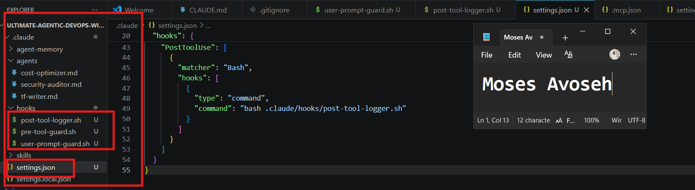

# Assignment 6 — Safety Rails for Your AI Agent

Part of the DevOps Micro Internship (DMI) Cohort 3 with Agentic AI

---

## Purpose

In this assignment, you will configure safety and control mechanisms for Claude Code using permissions and hooks. You will define team-level command restrictions and implement prompt-level and tool-level hooks to prevent destructive actions before they execute.

---

# Task 1 — Create settings.json with Permissions

## Goal

Create a team-level `settings.json` file with allow and deny rules for safe command execution.

### Evidence

#### Screenshot 1 — Screenshot 1 — `settings.json` open in VS Code showing the full permissions configuration

,,,,

---

# Task 2 — Add the UserPromptSubmit Hook

## Goal

Add a hook that intercepts user prompts before Claude starts execution and blocks destructive intent.

### Evidence

#### Screenshot 2 — settings.json showing UserPromptSubmit hook

---

# Task 3 — Add the PreToolUse Hook

## Goal

Extend `settings.json` with a PreToolUse hook that blocks dangerous Bash commands before execution.

### Evidence

#### Screenshot 3 — full settings.json with permissions and hooks

---

# Task 4 — Test the UserPromptSubmit Hook

## Goal

Verify that destructive prompts are blocked before Claude begins execution.

### Evidence

#### Screenshot 4 — blocked prompt due to UserPromptSubmit hook

---

# Task 5 — Test the PreToolUse Hook

## Goal

Verify that dangerous commands are intercepted before execution by the PreToolUse hook.

### Evidence

#### Screenshot 5 — PreToolUse hook blocking terraform destroy

,

---

# Submission Instructions

- Ensure `.claude/settings.json` is committed to your GitHub repository
- Run both hook tests successfully and capture required screenshots
- Push final changes to your forked repository

---

## GitHub Repository URL

Paste your forked repository URL here:

`https://github.com/DMIC3-G3-Avoseh-Moses/Ultimate-Agentic-DevOps-with-Claude-Code.git`

---

# Completion Checklist

- [✅ Completed ] `settings.json` created with permissions block
- [✅ Completed ] UserPromptSubmit hook added correctly
- [✅ Completed ] PreToolUse hook added correctly
- [✅ Completed ] Screenshot 3 shows full hooks + permissions configuration
- [✅ Completed ] Prompt-level destructive test was blocked (Screenshot 4)
- [✅ Completed ] Command-level `terraform destroy` was blocked (Screenshot 5)
- [✅ Completed ] `settings.json` committed and visible in GitHub repo

---

## 📌 About DMI & CloudAdvisory

DevOps Micro Internship (DMI) is a project-based DevOps program run by Pravin Mishra (The CloudAdvisory) focused on real-world execution, systems thinking, and career readiness.

It helps learners build strong DevOps foundations with hands-on experience.

---

## 📌 Resources

- 🌐 DMI Official Website: https://pravinmishra.com/dmi  
- 🎓 DevOps for Beginners (Udemy): https://www.udemy.com/course/devops-for-beginners-docker-k8s-cloud-cicd-4-projects/  
- 🎓 Agentic AI DevOps with Claude Code: https://www.udemy.com/course/ultimate-agentic-ai-devops-with-claude-code/  
- 🎓 DevOps with Claude Code: Terraform, EKS, ArgoCD & Helm: https://www.udemy.com/course/devops-with-claude-code-terraform-eks-argocd-helm/  
- ▶️ YouTube Playlist: https://www.youtube.com/playlist?list=PLFeSNDtI4Cho  
- 🔗 Pravin Mishra (LinkedIn): https://www.linkedin.com/in/pravin-mishra-aws-trainer/  
- 🏢 CloudAdvisory (LinkedIn): https://www.linkedin.com/company/thecloudadvisory/

---

*This submission is part of DevOps Micro Internship (DMI) Cohort 3 — Agentic AI Track.*