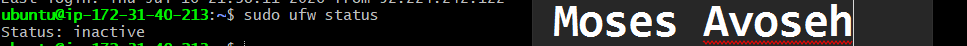
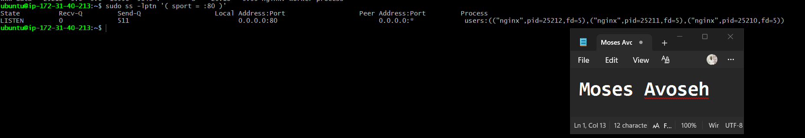
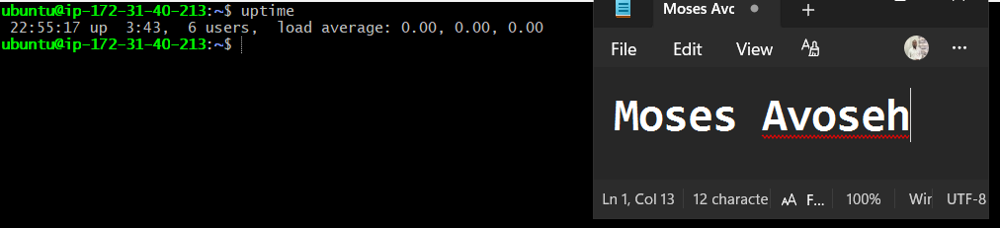
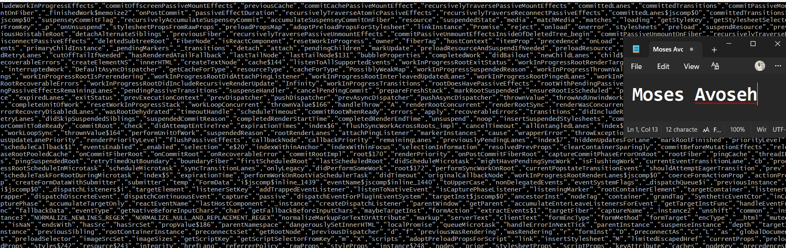
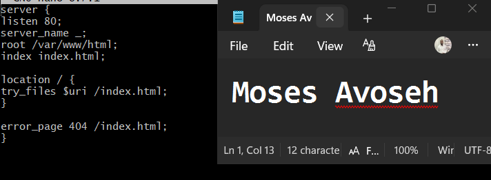
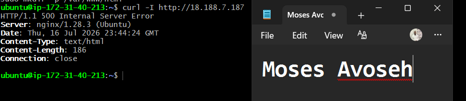

# Assignment 3 — Production Maintenance Drill (OPS Checklist)

Part of the DevOps Micro Internship (DMI) Cohort 3 with Agentic AI

---

## Purpose

In this assignment, you will treat your already deployed React application (on Ubuntu VM with Nginx) as a live production system. You will perform structured operational checks covering network validation, service health, log analysis, resource monitoring, configuration verification, and incident simulation with recovery — mirroring real on-call DevOps responsibilities.

---

# Task 1 — Server Access & Networking Validation

## Goal

Verify that the deployed React application is reachable from the browser and confirm basic network connectivity of the Ubuntu VM.

### Evidence

#### Screenshot 1 — Browser showing the React app with your Full Name visible on the UI

---

#### Screenshot 2 — Output of `ip a`

---

#### Screenshot 3 — Output of `sudo ss -tulpen`

---

#### Screenshot 4 — Output of `sudo ufw status`

---

### Notes

Answer the following in your own words:

**1. What proves Nginx is listening on 0.0.0.0:80?**

The sudo ss -tulpen command shows that Nginx is listening on 0.0.0.0:80. The address 0.0.0.0 indicates that the web server is accepting connections on all available network interfaces, not just the local machine. This means the website can be accessed from other devices over the internet. Since the process name is listed as nginx, it confirms that Nginx is the service using port 80.

---

**2. What proves SSH is active on port 22?**

The same command output also displays sshd listening on 0.0.0.0:22. This confirms that the SSH service is running and waiting for incoming connections on port 22 from any network interface. Because of this, remote access to the EC2 instance is possible using an SSH client.

---

**3. Did you find any unexpected open ports? Explain briefly.**

No unexpected ports were open. Only port 80 for the Nginx web server and port 22 for SSH were accessible from outside the server. Other services, such as chronyd and systemd-resolved, were listening only on local loopback addresses, which means they cannot be reached from the internet. This shows that only the required services are publicly available, improving the server's security.

---

# Task 2 — Service Health & Systemd Validation (Nginx)

## Goal

Verify that Nginx is properly installed, running, enabled at boot, and safely configured.

### Evidence

#### Screenshot 1 — Output of `systemctl status nginx --no-pager`

---

#### Screenshot 2 — Output of `sudo nginx -t`

---

#### Screenshot 3 — Output of `sudo ss -lptn '( sport = :80 )'`

---

### Notes

Answer the following in your own words:

**1. What happens if Nginx fails to restart in production?**

If Nginx fails to restart, the web server will stop serving requests, making the application unavailable to users. A failed restart is often caused by configuration errors, port conflicts, or issues with the service itself. Before restarting, it's good practice to run sudo nginx -t to validate the configuration and identify any errors. Resolving the issue quickly helps reduce downtime and restore access to the application.
---

**2. What's your basic rollback plan?**

My rollback plan would be to restore the last working Nginx configuration or the previous version of the application if the new deployment causes problems. After restoring the backup, I would test the Nginx configuration using sudo nginx -t and then restart the service. Finally, I would verify that the website is accessible and functioning correctly before considering the rollback complete.

---

# Task 3 — Logs & Request Trace

## Goal

Verify real traffic flow and analyze logs to understand system behavior and errors.

### Evidence

#### Screenshot 1 — Output of `sudo tail -n 30 /var/log/nginx/access.log`

---

#### Screenshot 2 — Output of `sudo tail -n 30 /var/log/nginx/error.log`

---

#### Screenshot 3 — Output of `sudo journalctl -u nginx --no-pager -n 50`

---

### Notes

Answer the following in your own words:

**1. Were there any errors in the logs?**

- If yes, mention 1–2 example error lines from the logs and explain what each one means in simple terms.
- If no, explain what it means if the error log is empty or shows no recent errors during your check.

The error log (/var/log/nginx/error.log) shows only one line:
2026/07/16 19:36:10 [notice] 24330#24330: using inherited sockets from "5;6;"  
This is not an error, but a notice indicating that Nginx reused existing sockets when restarting.

Therefore, no actual errors appear in the logs.
An empty or clean error log means the web server is running smoothly without configuration or runtime issues.

---

**2. If there were no errors, what does that indicate about the system?**

It indicates that the system is stable and functioning correctly.

Nginx is starting, stopping, and serving requests without problems.

The absence of errors suggests that there are no misconfigurations, crashes, or failed requests during the observed period.

---

**3. Based on the access logs, were your curl requests visible in the log entries? What does that prove about traffic flow?**

Yes — the access log shows several entries with user agents like "curl/8.18.0" and "curl/8.18.0".

These entries confirm that your curl requests reached the server successfully and were logged.

That proves traffic flow is working correctly — requests are being received, processed, and logged by Nginx, meaning the network and server are communicating as expected.

---

# Task 4 — System Resource Health Check (Capacity Red Flags)

## Goal

Assess server capacity and detect potential performance or failure risks.

### Evidence

#### Screenshot 1 — Output of `uptime`

---

#### Screenshot 2 — Output of `free -h`

---

#### Screenshot 3 — Output of `df -h`

---

#### Screenshot 4 — Output of `sudo du -sh /var/* | sort -h`

---

### Notes

Answer the following in your own words:

**1. Which resource looks most critical right now? (CPU/load, memory, or disk) Explain why.**

The most critical resource to monitor is disk space, because while CPU and memory are fine, the disk is already over halfway full (59%) on a small 6.7 GB partition. If logs or cache expand, it could reach capacity soon

---

**2. What happens if disk becomes 100% full in a production server?**

If the disk becomes 100% full in a production server, the system will be unable to write new data such as logs, temporary files, or database entries. As a result, essential services like Nginx, MySQL, or systemd may crash or fail to start, and user requests could return errors like “500 Internal Server Error” or “Read-only file system.” This situation also increases security risks because monitoring and logging stop functioning, and in severe cases, the server may become unresponsive or fail to boot properly. Therefore, it’s crucial to implement disk monitoring and log rotation to prevent such failures.

---

# Task 5 — Configuration & Deployment Verification

## Goal

Ensure the correct React build is deployed and Nginx is serving it properly.

### Evidence

#### Screenshot 1 — Output of `ls -lah /var/www/html | head -n 20`

---

#### Screenshot 2 — Output of `grep -R "Deployed by" -n /var/www/html 2>/dev/null | head`

---

#### Screenshot 3 — Output of `grep -n "try_files" /etc/nginx/sites-available/default`

---

### Notes

Answer the following in your own words:

**1. How do you confirm that the correct version of the application is deployed?**

It can be confirmed that the correct version of the application is deployed by checking the configuration and the files served by the web server. In this case, the command output shows the Nginx configuration using the directive try_files $uri /index.html;, which means the server is correctly set up to serve the application’s main entry point. Additionally, verifying the deployed files—such as inspecting the contents of index.html or checking version identifiers within the code or build metadata—ensures that the expected version is active. This combination of configuration validation and file inspection confirms that the correct application version is deployed.

---

# Task 6 — Nginx Configuration Failure Simulation

## Goal

Simulate a real-world Nginx misconfiguration and recover the service safely.

### Evidence

#### Screenshot 1 — Output of `sudo nginx -t` showing the syntax error (broken config)

---

#### Screenshot 2 — Output of `sudo nginx -t` showing syntax ok (fixed config)

.

---

#### Screenshot 3 — Output of `curl -I http://<public-ip>` confirming recovery (200 OK)

---

### Notes

Answer the following in your own words:

**1. What caused the configuration failure?**

Write your answer here.
The configuration failure was caused by an error or misconfiguration in the Nginx site file (/etc/nginx/sites-available/default). Before fixing it, Nginx likely had invalid syntax or missing directives that prevented it from starting correctly. Running sudo nginx -t helped identify and confirm whether the syntax was valid.
---

**2. How did you fix the issue?**

The issue was fixed by editing the Nginx configuration file using sudo nano /etc/nginx/sites-available/default, correcting the syntax, and then verifying it with sudo nginx -t. Once the test showed “syntax is ok” and “test is successful,” Nginx was restarted using sudo systemctl restart nginx. The curl -I http://18.188.7.187 command confirmed the fix by returning an HTTP/1.1 200 OK response, meaning the server was running properly.

---

**3. How can you avoid this kind of issue in real production systems?**

To avoid configuration failures in real production systems, it’s essential to always test configuration changes with nginx -t before restarting the service, use version control tools like Git to track and manage configuration updates, implement automated configuration validation within CI/CD pipelines, maintain backup copies of stable configurations, and apply staging environments to thoroughly test updates before deploying them to production. These practices ensure reliability, prevent downtime, and maintain system stability.

---

# Task 7 — Web Application Failure Simulation

## Goal

Simulate missing deployment content and recover the application safely.

### Evidence

#### Screenshot 1 — Output of `curl -I http://<public-ip>` showing failure (non-200 response)

---

#### Screenshot 2 — Output of `curl -I http://<public-ip>` confirming recovery (200 OK)

---

### Notes

Answer the following in your own words:

**1. What caused the application to break in this scenario?**

The application broke because the /var/www/html directory, which contained the website files, was moved to a backup location. As a result, Nginx could not find the required files to serve, leading to a 500 Internal Server Error when trying to access the site.

---

**2. How did you fix the issue and restore the application?**

To fix the issue, the original web files were restored by moving the backup directory back to /var/www/html. After restoring the files, Nginx was restarted using sudo systemctl restart nginx, and the application began responding correctly with an HTTP 200 OK status.

---

**3. What steps would you take to prevent this kind of issue in real production systems?**

In production, it’s important to maintain proper file backups, use version control for configuration changes, and perform testing in a staging environment before modifying live directories. Additionally, implementing monitoring and alerts can help detect missing files or service failures early to prevent downtime.

---

# Task 8 — Security & Reliability Review

## Goal

Review and reflect on the security and reliability practices applied during this assignment.

### Security & Reliability Notes

Answer the following in your own words:

**1. Why is SSH key-based authentication more secure than sharing passwords?**

SSH key-based authentication is more secure because it uses cryptographic keys instead of plain passwords, making it nearly impossible to guess or brute-force. The private key stays on the user’s machine, while the public key is stored on the server, ensuring that only authorized users can connect. This eliminates the risk of password leaks or interception during login.

---

**2. Why should only required ports be open on a production server?**

Only required ports should be open to reduce the attack surface of the server. Open ports can expose services to unauthorized access or exploitation by attackers. By closing unnecessary ports, you strengthen network security and ensure that only essential services are accessible to legitimate users.

---

**3. Why is it important for Nginx to be enabled on boot?**

Enabling Nginx on boot ensures that the web server automatically starts whenever the system restarts or powers on. This guarantees continuous availability of hosted applications without manual intervention, minimizing downtime and maintaining service reliability for users.

---

**4. What are the risks of sharing secrets, keys, or credentials publicly?**

Sharing secrets, keys, or credentials publicly can lead to unauthorized access, data breaches, and system compromise. Attackers can use exposed credentials to steal sensitive information, modify configurations, or deploy malicious code. Protecting these assets is critical to maintaining system integrity and security.

---

**5. Why should cloud resources be stopped or terminated when they are no longer needed?**

Cloud resources should be stopped or terminated when not in use to avoid unnecessary costs and reduce security risks. Idle resources still consume billing and may expose unused endpoints to potential attacks. Proper resource management ensures efficiency, cost savings, and a secure cloud environment.
---

# LinkedIn Post (Required)

## Evidence

#### LinkedIn Post URL

Paste your LinkedIn post URL here:

`https://www.linkedin.com/posts/moses-avoseh_strengthening-my-devops-server-management-share-7483675302179614721-iDNW/?utm_source=share&utm_medium=member_desktop&rcm=ACoAACZiz20BSL2chCMaU_0WK_2_7qktttgciMQ`

---

#### Screenshot — Published LinkedIn post

---

# Submission Instructions

- Add all required screenshots in your submission
- Full name must be visible in required screenshots
- Do not expose sensitive information (keys, passwords, account IDs)

---

# Completion Checklist

- [✅ Completed] Task 1: Screenshots (browser, ip a, ss -tulpen, ufw status) + Notes answered
- [✅ Completed] Task 2: Screenshots (nginx status, nginx -t, ss port 80) + Notes answered
- [✅ Completed] Task 3: Screenshots (access log, error log, journalctl) + Notes answered
- [✅ Completed] Task 4: Screenshots (uptime, free -h, df -h, du -sh) + Notes answered
- [✅ Completed] Task 5: Screenshots (ls html, grep deployed by, grep try_files) + Notes answered
- [✅ Completed] Task 6: Screenshots (nginx -t fail, nginx -t pass, curl recovery) + Notes answered
- [✅ Completed] Task 7: Screenshots (curl failure, curl recovery) + Notes answered
- [✅ Completed] Task 8: Security & Reliability Notes answered
- [✅ Completed] LinkedIn post published and URL submitted
- [✅ Completed] Full Name visible in all required screenshots
- [✅ Completed] No sensitive data exposed

---

## 📌 About DMI & CloudAdvisory

DevOps Micro Internship (DMI) is a project-based DevOps program run by Pravin Mishra (The CloudAdvisory) focused on real-world execution, systems thinking, and career readiness.

It helps learners build strong DevOps foundations with hands-on experience.

---

## 📌 Resources

- 🌐 DMI Official Website: https://pravinmishra.com/dmi  
- 🎓 DevOps for Beginners (Udemy): https://www.udemy.com/course/devops-for-beginners-docker-k8s-cloud-cicd-4-projects/  
- 🎓 Agentic AI DevOps with Claude Code: https://www.udemy.com/course/ultimate-agentic-ai-devops-with-claude-code/  
- 🎓 DevOps with Claude Code: Terraform, EKS, ArgoCD & Helm: https://www.udemy.com/course/devops-with-claude-code-terraform-eks-argocd-helm/  
- ▶️ YouTube Playlist: https://www.youtube.com/playlist?list=PLFeSNDtI4Cho  
- 🔗 Pravin Mishra (LinkedIn): https://www.linkedin.com/in/pravin-mishra-aws-trainer/  
- 🏢 CloudAdvisory (LinkedIn): https://www.linkedin.com/company/thecloudadvisory/

---

*This submission is part of DevOps Micro Internship (DMI) Cohort 3 — Agentic AI Track.*