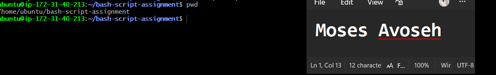
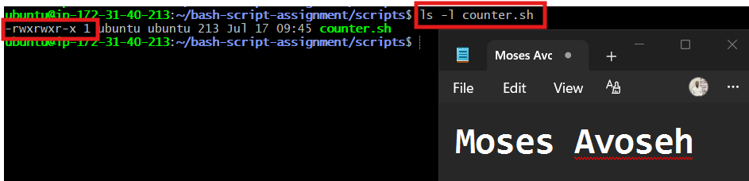
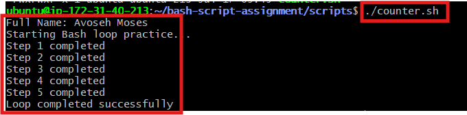
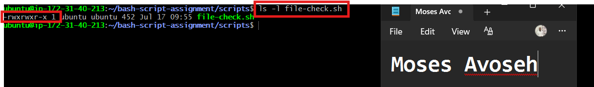
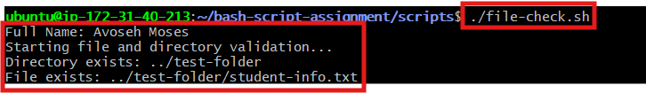

# Assignment 5 — Bash Script Automation Drill (OPS Checklist)

Part of the DevOps Micro Internship (DMI) Cohort 3 with Agentic AI

---

## Purpose

In this assignment, you will practice Bash scripting by building a series of small automation scripts covering environment setup, variables, arrays, loops, file conditionals, if-else logic, and functions. These scripts form the foundation of real-world Linux automation used in DevOps, cloud, and production support environments.

---

# Task 1 — Bash Environment & Workspace Setup

## Goal

Verify that Bash is available on your system and create a clean workspace for this assignment.

### Evidence

#### Screenshot 1 — Output of `echo $SHELL` and `bash --version`

,

---

#### Screenshot 2 — Output of `pwd` and `ls -lah` showing the scripts directory

,

---

### Notes

Answer the following in your own words:

**1. What is Bash?**

Bash, which stands for Bourne Again Shell, is a command-line interpreter and scripting language used mainly on Linux and Unix-based systems. It allows users to communicate with the operating system by entering commands or running scripts that automate tasks. Because of its flexibility and ease of use, Bash is one of the most widely used shells in Linux.

---

**2. What is the difference between shell and Bash?**

A shell is a program that acts as a bridge between the user and the operating system, allowing users to execute commands. Bash is a specific type of shell that offers many advanced features for both command-line use and scripting. Besides Bash, there are other shells such as sh, zsh, ksh, and fish. While they all serve the same basic purpose, they differ in their syntax, features, customization options, and scripting capabilities.

---

**3. Why is it important to confirm the Bash version before writing scripts?**

Checking the Bash version before writing a script is important because different versions support different features and syntax. By confirming the installed version, you can ensure that the commands and scripting features you plan to use are compatible with the system, helping to avoid errors and improve script reliability.

---

# Task 2 — Your First Bash Script

## Goal

Create your first Bash script, make it executable, and run it from the terminal.

### Evidence

#### Screenshot 1 — Content of `first-script.sh`


---

#### Screenshot 2 — Output of `./first-script.sh`


---

#### Screenshot 3 — Output of `ls -l first-script.sh` showing executable permission


---

### Notes

Answer the following in your own words:

**1. What is the purpose of `#!/bin/bash`?**

#!/bin/bash is called the shebang line. It tells the operating system to use the Bash interpreter to run the commands inside the script.

---

**2. Why do we use `chmod +x` before running a script?**

A newly created script may not have execute permission. The chmod +x command adds execute permission, allowing us to run the script directly using ./first-script.sh.

---

**3. What is the difference between running a script using `./script.sh` and `bash script.sh`?**

Add your answer here.
When we run: ./script.sh the system runs the file directly. Therefore, the script must have execute permission, and the shebang line determines which interpreter should run it. 

When we run: bash script.sh we are directly asking Bash to read and run the script. The script does not need execute permission for this method, and Bash is used even if the script has a different shebang. 

---

# Task 3 — Variables: User Information Script

## Goal

Use variables to store and display user-related information.

### Evidence

#### Screenshot 1 — Content of `user-info.sh`


---

#### Screenshot 2 — Output of `./user-info.sh`


---

### Notes

Answer the following in your own words:

**1. What is a variable in Bash?**

A variable is a named storage location used to hold a value that can be accessed and reused later in a script. For example, you can store a person's name in a variable and use that variable whenever you need to display or reference the name without typing it again.

---

**2. Why should we avoid spaces around the `=` sign when creating variables?**

In Bash, there must be no spaces around the = sign when assigning a value to a variable. If spaces are included, Bash does not recognize it as a variable assignment. Instead, it interprets the variable name as a command and the remaining text as its arguments, which results in an error.

Correct:

course_name="Linux and Bash Scripting"

Incorrect:

course_name = "Linux and Bash Scripting"

In the incorrect example, Bash interprets:

course_name as a command
= as the first argument
"Linux and Bash Scripting" as another argument

Since course_name is not a command, Bash returns a "command not found" error.


---

**3. How do you access the value stored inside a Bash variable?**

We add the $ symbol before the variable name to access its stored value. 
Example:  echo "$course_name"
Here, $course_name returns the value stored inside the course_name variable. 
	Linux and Bash Scripting


---

# Task 4 — Arrays & Loops: Tools Checklist Script

## Goal

Use arrays and loops to print a checklist of tools used in Bash scripting.

### Evidence

#### Screenshot 1 — Content of `tools-checklist.sh`


---

#### Screenshot 2 — Output of `./tools-checklist.sh`


---

### Notes

Answer the following in your own words:

**1. What is an array in Bash?**

An array is used to store multiple values under one variable name. In this script, the tools array stores several Linux and Bash tools.
Example:
tools=("bash" "nano" "chmod" "echo" "ls" "pwd")


---

**2. Why are arrays useful in scripts?**

Arrays help us store related values in a single variable. Instead of creating separate variables for each tool, we can keep them all in one array. This makes the script more organized, easier to read, and simpler to update. When needed, the values can be processed efficiently using a loop.


---

**3. What does `"${tools[@]}"` mean?**

"${tools[@]}" is used to access all the values stored in the tools array. It allows a loop to go through each item in the array one by one. The double quotes ensure that each array element is treated as a separate value, which is important when an item contains spaces.

---

**4. What is the purpose of the `for` loop in this script?**

The for loop is used to go through each value in the tools array one at a time. In each iteration, the current array value is stored in the tool variable and displayed in the terminal. The loop continues running until all the tools in the array have been processed.

---

# Task 5 — Loops: Number Counter Script

## Goal

Use loops to repeat a task multiple times.

### Evidence

#### Screenshot 1 — Content of `counter.sh`



---

#### Screenshot 2 — Output of `./counter.sh`



---

### Notes

Answer the following in your own words:

**1. What is a loop?**

A loop is a programming structure used to repeat a set of instructions multiple times. It helps avoid writing the same commands repeatedly by allowing the task to run automatically until a specific condition is met.


---

**2. Why do we use loops in Bash scripting?**

Loops are used to automate tasks that need to be repeated multiple times. They help make scripts shorter, cleaner, and easier to manage by reducing the need to write the same commands again and again.


---

**3. How many times did the loop run in your script?**

The loop ran five times because the script contained five values: 1, 2, 3, 4, and 5. The loop executed once for each value until all the numbers were processed.

---

**4. What would you change if you wanted the loop to run 10 times?**

To make the loop run 10 times, I would add more values from 6 to 10 in the list used by the for loop. This allows the loop to execute once for each number, giving a total of 10 iterations.

Example:

for number in 1 2 3 4 5 6 7 8 9 10
do
    echo "Step $number completed"
done

---

# Task 6 — Files & Conditionals: File Validation Script

## Goal

Use file checks and conditionals to verify whether files and directories exist.

### Evidence

#### Screenshot 1 — Output of `ls -lah ../test-folder`


---

#### Screenshot 2 — Content of `file-check.sh`



---

#### Screenshot 3 — Output of `./file-check.sh`



---

### Notes

Answer the following in your own words:

**1. What does `-d` check in Bash?**

In Bash, the -d option is used to check whether a specified path exists and is a directory. If the directory is present, the condition returns true; otherwise, it returns false.

---

**2. What does `-f` check in Bash?**

In Bash, the -f option is used to check whether a specified path exists and is a regular file. If the file is available and is a normal file, the condition returns true; otherwise, it returns false.

---

**3. Why should file and directory paths be stored in variables?**

Storing file and directory paths in variables makes scripts more organized, readable, and easier to maintain. If a path needs to be changed, we only have to update the variable once instead of modifying it in multiple locations throughout the script.

---

**4. What happens if the file does not exist?**

If the file does not exist, the `-f` condition returns **false**. As a result, the commands inside the `else` block will be executed, and the script will display the following message:

```text
File does not exist: ../test-folder/student-info.txt
```


---

# Task 7 — Conditionals: Pass or Retry Script

## Goal

Use if-else conditionals to make decisions based on a variable value.

### Evidence

#### Screenshot 1 — Content of `score-check.sh` with `score=85`


---

#### Screenshot 2 — Output showing `Result: Pass`


---

#### Screenshot 3 — Content of `score-check.sh` with `score=55`


---

#### Screenshot 4 — Output showing `Result: Retry`


---

### Notes

Answer the following in your own words:

**1. What is the purpose of if-else in Bash?**

An if-else statement is used to make decisions in a Bash script. It checks whether a condition is true or false. If the condition is true, one set of commands is executed; if the condition is false, the commands inside the else block are executed

---

**2. What does `-ge` mean?**

In Bash, -ge is a comparison operator that means "greater than or equal to." It is used to check whether one number is greater than or equal to another value. In this script, it checks if the score variable is 70 or higher.

Example:

[ "$score" -ge 70 ]

If the score is 70 or above, the condition returns true; otherwise, it returns false.

---

**3. Why should conditions be tested with different values?**

Testing conditions with different values ensures that the script handles all possible cases correctly. For example, testing 85 checks the Pass result, while 55 checks the Retry result. Testing the boundary value 70 confirms that the minimum passing score works properly.

---

**4. How can conditionals help in automation scripts?**

Conditionals allow automation scripts to make decisions based on different situations. They can check conditions such as whether a file exists, a service is running, or disk space is low, and then perform the appropriate action.

---

# Task 8 — Functions: Final Bash Automation Script

## Goal

Create a final Bash script using functions to organize reusable code.

### Evidence

#### Screenshot 1 — Content of `final-automation.sh`


---

#### Screenshot 2 — Output of `./final-automation.sh`


---

#### Screenshot 3 — Output of `ls -lah` showing all created scripts


---

### Notes

Answer the following in your own words:

**1. What is a function in Bash?**

A function in Bash is a named group of commands created to perform a specific task. Once a function is defined, we can execute all the commands inside it by calling the function name, which helps make scripts more organized and reusable.

---

**2. Why are functions useful in scripts?**

Functions help divide a large script into smaller, organized sections. They make scripts easier to read, maintain, and debug. If the same task is needed multiple times, we can call the function instead of writing the same commands again.

---

**3. Which functions did you create in this script?**

Add your answer here.
I created four functions in the script: print_header to display the assignment header, print_user_details to show my name and assignment information, check_files to verify that the required directory and file exist, and print_tools to display each tool stored in the array using a loop.
---

**4. How does this final script combine variables, arrays, loops, conditionals, files, and functions?**

The script uses variables to store information such as my name, assignment name, and file paths. It uses an array to store tool names and a loop to display them one by one. The if-else conditions with -d and -f check whether the required directory and files exist. Functions organize the commands into separate sections, making the automation script easier to run and maintain.

---

# LinkedIn Post (Required)

## Evidence

#### LinkedIn Post URL

Paste your LinkedIn post URL here:

`https://www.linkedin.com/posts/moses-avoseh_completed-bash-script-automation-drill-share-7483839881975242753-a1Uw/?utm_source=share&utm_medium=member_desktop&rcm=ACoAACZiz20BSL2chCMaU_0WK_2_7qktttgciMQ`

---

#### Screenshot — Published LinkedIn post


---

# Submission Instructions

- Add all required screenshots in your submission
- Full name must be visible in required screenshots
- All script files must be created and run successfully
- Required notes must be answered clearly for every task
- Do not expose sensitive information (keys, passwords, credentials)

---

# Completion Checklist

- [✅ Completed] Task 1: Environment setup verified, workspace created (Screenshots 1–2, Notes answered)
- [✅ Completed] Task 2: First script created, executed, permissions verified (Screenshots 1–3, Notes answered)
- [✅ Completed] Task 3: Variables script created and run (Screenshots 1–2, Notes answered)
- [✅ Completed] Task 4: Arrays and loops script created and run (Screenshots 1–2, Notes answered)
- [✅ Completed] Task 5: Counter loop script created and run (Screenshots 1–2, Notes answered)
- [✅ Completed] Task 6: File validation script created and run (Screenshots 1–3, Notes answered)
- [✅ Completed] Task 7: Pass/Retry conditional script tested with both values (Screenshots 1–4, Notes answered)
- [✅ Completed] Task 8: Final automation script created and run (Screenshots 1–3, Notes answered)
- [✅ Completed] All scripts run without errors
- [✅ Completed] Full Name visible in all required screenshots
- [✅ Completed] LinkedIn post published and URL submitted
- [✅ Completed] No sensitive data exposed

---

## 📌 About DMI & CloudAdvisory

DevOps Micro Internship (DMI) is a project-based DevOps program run by Pravin Mishra (The CloudAdvisory) focused on real-world execution, systems thinking, and career readiness.

It helps learners build strong DevOps foundations with hands-on experience.

---

## 📌 Resources

- 🌐 DMI Official Website: https://pravinmishra.com/dmi  
- 🎓 DevOps for Beginners (Udemy): https://www.udemy.com/course/devops-for-beginners-docker-k8s-cloud-cicd-4-projects/  
- 🎓 Agentic AI DevOps with Claude Code: https://www.udemy.com/course/ultimate-agentic-ai-devops-with-claude-code/  
- 🎓 DevOps with Claude Code: Terraform, EKS, ArgoCD & Helm: https://www.udemy.com/course/devops-with-claude-code-terraform-eks-argocd-helm/  
- ▶️ YouTube Playlist: https://www.youtube.com/playlist?list=PLFeSNDtI4Cho  
- 🔗 Pravin Mishra (LinkedIn): https://www.linkedin.com/in/pravin-mishra-aws-trainer/  
- 🏢 CloudAdvisory (LinkedIn): https://www.linkedin.com/company/thecloudadvisory/

---

*This submission is part of DevOps Micro Internship (DMI) Cohort 3 — Agentic AI Track.*