# Assignment 6 — Build an AI-Assisted Linux Health Check (AI-Assisted Linux Incident Triage)

Part of the DevOps Micro Internship (DMI) Cohort 3 with Agentic AI

---

## Purpose

In this assignment, you will build a read-only Bash triage script that checks the health of your Ubuntu server and Nginx application, connect it to Claude Code as a reusable `/linux-triage` skill, simulate a controlled Nginx incident, use the skill to gather and analyze evidence, recover the service manually, and verify recovery. The workflow follows the Agentic Loop: Gather → Analyze → Human Act → Verify.

---

# Task 1 — Confirm the Healthy Baseline and Create the Workspace

## Goal

Confirm that Nginx and the React application are healthy before building the automation.

### Evidence

#### Screenshot 1 — Output of `systemctl is-active nginx`, `ss -ltn | grep ':80'`, and `curl -I http://localhost`

,,

---

#### Screenshot 2 — Output of `pwd` and `find . -maxdepth 4 -type d | sort` showing the workspace folder structure

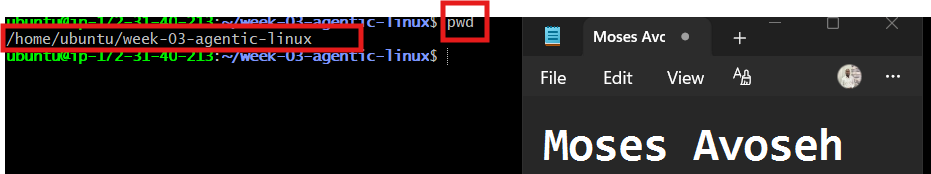,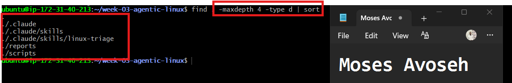

---

### Notes

Answer the following in your own words:

**1. What proves that Nginx is running?**

Running the command systemctl is-active nginx and receiving the output active confirms that the Nginx service is currently running successfully.

---

**2. What proves that the server is listening for HTTP traffic?**

The command ss -ltn | grep ':80' shows that port 80 is in a listening state. This confirms that the server is ready to accept incoming HTTP requests.

---

**3. Why must you capture a healthy baseline before simulating an incident?**

A healthy baseline helps confirm that the system is working properly before an incident is introduced. After simulating the issue, we can compare the current state with the baseline to identify what changed. Once the problem is resolved, we can verify that the system has returned to normal operation.

---

# Task 2 — Create Project Context and Safety Rules in CLAUDE.md

## Goal

Tell Claude exactly what this project does and what it is not allowed to do.

### Evidence

#### Screenshot 3 — CLAUDE.md open in VS Code showing all four sections (Project Overview, Incident Workflow, Safety Rules, Output Rules)

---

### Notes

Answer the following in your own words:

**1. Why should Claude receive project-specific operational rules?**

Claude should receive project-specific rules so it understands the purpose of the project, required procedures, and actions that should be avoided. This helps ensure its responses follow the correct incident workflow and prevents unnecessary or risky changes.

---

**2. Why is the human required to execute the recovery command?**

A human must review the evidence and confirm that the recovery command is safe before executing it. Claude can suggest possible solutions, but it should not directly make changes to the server without human approval.

---

**3. Which rule prevents Claude from making an unsupported diagnosis?**

The rule “Do not claim a root cause unless the report contains supporting evidence” prevents Claude from making unsupported diagnoses. It ensures that any conclusion is based only on verified information from the report.

---

# Task 3 — Use Agentic AI to Plan Before Writing the Script

## Goal

Use Claude Code to inspect the environment and produce a read-only plan before creating any Bash code.

### Evidence

#### Screenshot 4 — Claude Code showing the five-check plan and read-only inspection results

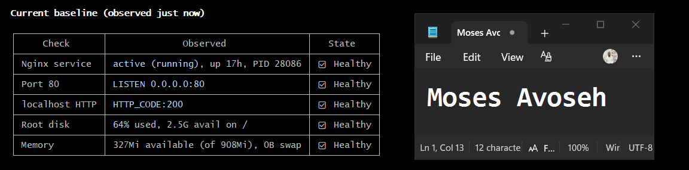,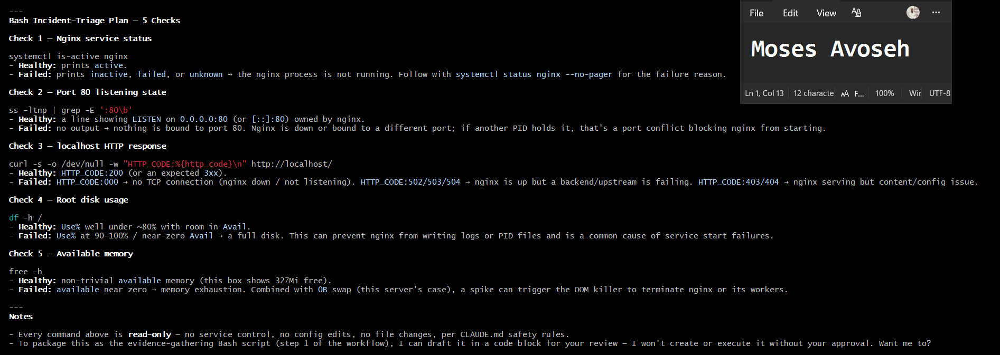,

---

### Notes

Answer the following in your own words:

**1. Which part of this task represents the Gather phase?**

The read-only inspection of the Ubuntu server represents the Gather phase. During this phase, information is collected about Nginx status, port 80 availability, HTTP response, disk usage, and memory without making any changes to the system.

---

**2. Did Claude follow the instruction not to create files? How did you verify this?**

Yes, Claude followed the instruction and performed only read-only checks. I verified this by reviewing the workspace contents and confirming that no new files, scripts, or other changes were created.

---

**3. Why is planning before coding useful in DevOps automation?**

Planning before coding helps define what the script should check, how results should be handled, and what actions are required. It also helps identify missing or unsafe steps early, making the final automation script more reliable and easier to maintain.

---

# Task 4 — Build the Linux Triage Bash Script

## Goal

Create one Bash script that gathers consistent Linux and Nginx health evidence.

### Evidence

#### Screenshot 5 — Top section of `linux-triage.sh` showing variables, thresholds, and the checks array

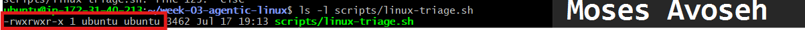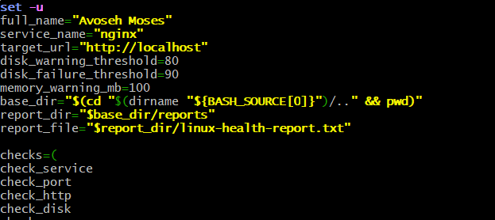

---

#### Screenshot 6 — Middle section showing check functions and conditionals

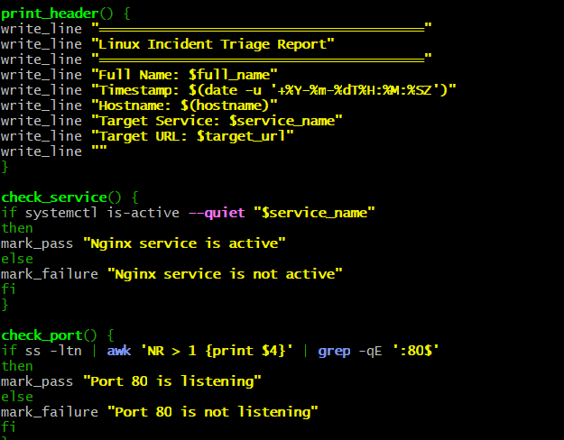

---

#### Screenshot 7 — Bottom section showing the loop, summary function, and exit behavior

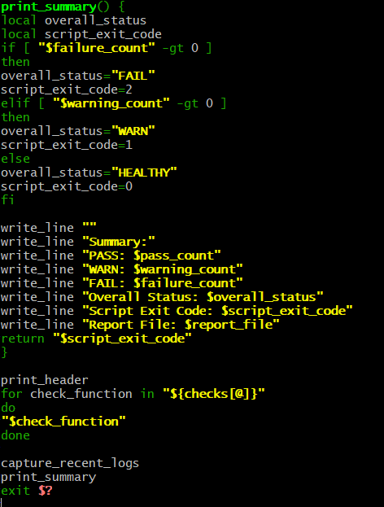

---

#### Screenshot 8 — Output of `bash -n scripts/linux-triage.sh` (no syntax errors) and `ls -l scripts/linux-triage.sh` showing executable permission

,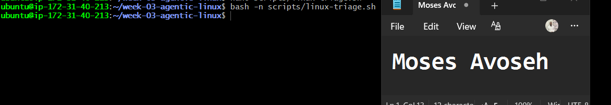

---

### Notes

Answer the following in your own words:

**1. What is stored in the checks array?**

The checks array stores the names of the five functions used for system validation. These functions check the Nginx service status, port 80 availability, HTTP response, disk usage, and available memory.

---

**2. How does the `for` loop use that array?**

The for loop reads each function name stored in the checks array and executes them one by one. This allows the script to run all five health checks in the correct order without writing each function call separately.

---

**3. Why are the health checks separated into functions?**

The health checks are separated into functions so that each function handles one specific task. This makes the script easier to read, test, maintain, and troubleshoot because changes to one check do not affect the others.
---

**4. What is the purpose of `$(...)` in this script?**

The $(...) syntax is used for command substitution, which runs a command and stores its output in a variable or uses it in the script. In this script, it collects information such as the timestamp, hostname, HTTP status code, disk usage, available memory, and recent Nginx logs.

---

**5. Why does the script use different exit codes for HEALTHY, WARN, and FAIL?**

Different exit codes allow the script to clearly show the health status of the system. Monitoring tools and automation systems can use these codes to identify whether the system is healthy, needs attention, or has a failure that requires action.

---

# Task 5 — Run and Understand the Healthy-State Report

## Goal

Run the Bash script against the healthy server and verify that it creates a report.

### Evidence

#### Screenshot 9 — Output of `./scripts/linux-triage.sh` showing your Full Name and all five check results

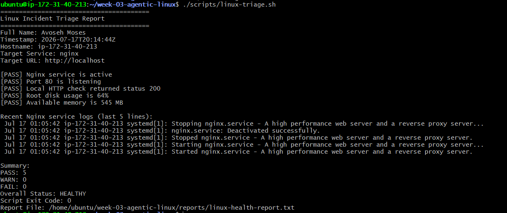

---

#### Screenshot 10 — Output showing the captured exit code and final summary

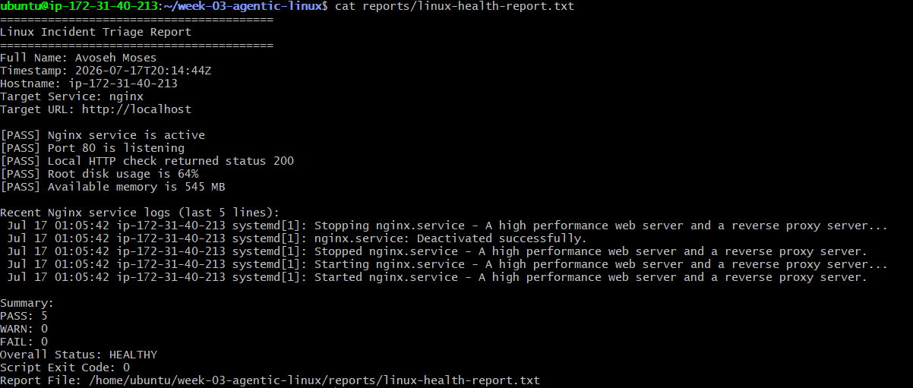

---

### Notes

Answer the following in your own words:

**1. What is the overall status of your healthy baseline?**

The overall status of my baseline is HEALTHY. The report does not contain any failed checks, so I can continue to the incident simulation.

---

**2. Which exact Linux evidence proves the application is serving traffic?**

The report shows:
[PASS] Port 80 is listening
[PASS] Local HTTP check returned status 200

Port 80 listening confirms that the server is ready to receive HTTP traffic. The HTTP status 200 confirms that the application responded successfully through Nginx.

---

**3. Did your script return exit code 0 or 1? Explain why.**

My script returned exit code 0 because all five health checks passed. Nginx was active, port 80 was listening, the application returned HTTP 200, and the disk and memory values were within the healthy limits.

---

**4. What is the difference between a warning and a failure in this script?**

A warning means the system is still working, but a resource issue needs attention, such as disk usage reaching 80–89% or low available memory.
A failure means a critical health check has failed, such as Nginx being inactive, port 80 not listening, HTTP not returning 200, or disk usage reaching 90% or higher.
Warnings indicate potential problems that should be monitored, while failures indicate service-impacting issues requiring action.
The script reports the severity through its exit code: 0 for healthy, 1 for warnings, and 2 for failures.

---

# Task 6 — Create and Run the /linux-triage Skill

## Goal

Turn the Bash script into a reusable, manually invoked Agentic AI workflow.

### Evidence

#### Screenshot 11 — `SKILL.md` showing the frontmatter, allowed tool restrictions, and safety rules

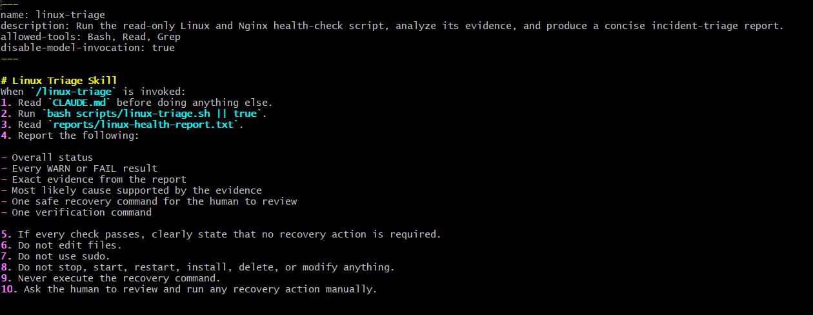,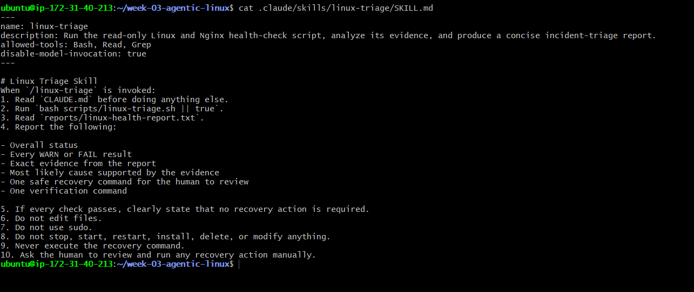

---

#### Screenshot 12 — `/linux-triage` output for the healthy server

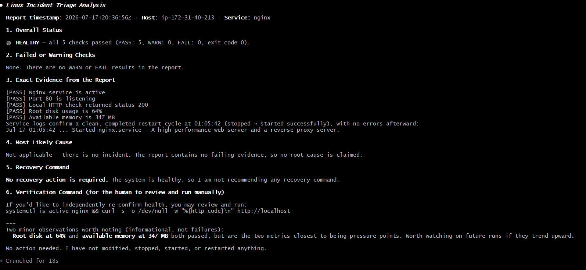

---

### Notes

Answer the following in your own words:

**1. Why does this skill have Bash, Read, and Grep, but not Write?**

The skill includes Bash, Read, and Grep because Bash is used to run the Linux triage script, Read is used to view the generated health report, and Grep is used to search for specific PASS, WARN, or FAIL results. It does not include the Write tool because the triage process is intended for checking and analyzing system health, not for creating or modifying project files.

---

**2. Why is `disable-model-invocation: true` useful for this skill?**

The disable-model-invocation: true setting is useful because it prevents Claude from automatically selecting and running the skill on its own. The user must manually invoke /linux-triage, which keeps the server inspection intentional, controlled, and only performed when requested.

---

**3. What part is performed by Bash, and what part is performed by Claude?**

The Bash script performs the actual Linux health checks by verifying Nginx status, port 80 availability, HTTP response, disk usage, memory availability, and recent logs. It then records the results in linux-health-report.txt.

Claude reads and interprets the report, explains the findings, identifies warnings or failures, and suggests safe next steps. Claude does not directly modify the system or perform recovery actions.

---

**4. Why is this better than asking Claude "Is my server healthy?" without giving it evidence?**

This is better because asking Claude, “Is my server healthy?” without evidence does not provide enough information about the actual system state. The /linux-triage skill first collects real-time server evidence using the Bash script, including Nginx status, port availability, HTTP response, disk usage, memory, and logs. Claude can then analyze the collected data and provide an accurate assessment instead of making assumptions or guessing.

---

# Task 7 — Simulate an Nginx Incident and Let the Skill Diagnose It

## Goal

Create a controlled service failure, gather evidence through Bash, and let Claude analyze the evidence without taking recovery action.

### Evidence

#### Screenshot 13 — Output showing Nginx is inactive and the HTTP request fails

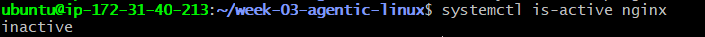,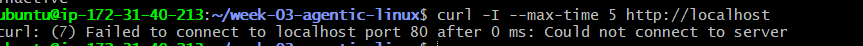

---

#### Screenshot 14 — `/linux-triage` output showing failed evidence, most likely cause, and a suggested recovery command

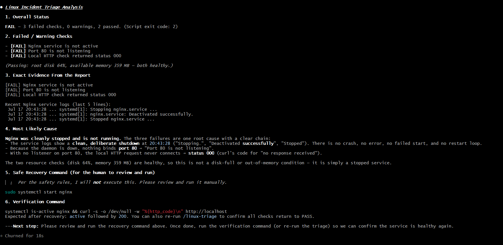

---

#### Screenshot 15 — `incident-failure-report.txt` showing the failed checks and your Full Name

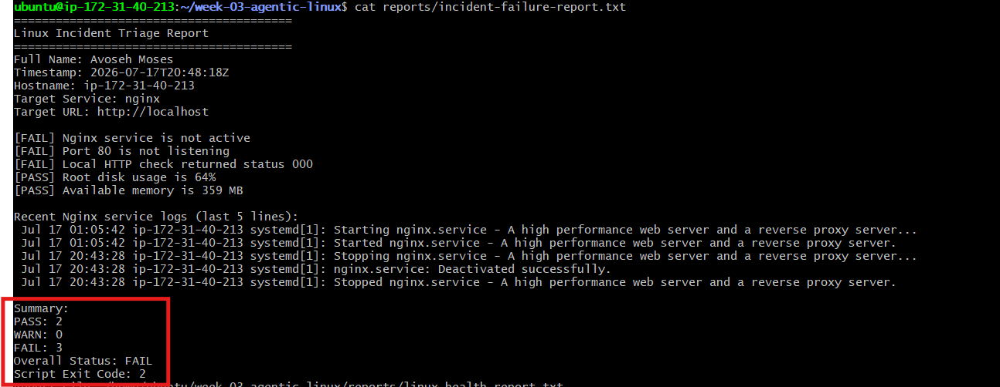

---

### Notes

Answer the following in your own words:

**1. Which three checks failed?**

The Nginx service check, port 80 check, and local HTTP check failed. The disk and memory checks were not affected by stopping Nginx.

---

**2. What evidence supports the conclusion that Nginx is unavailable?**

The report shows that Nginx is not active, port 80 is not listening, and the local HTTP request returned status 000. Together, these results show that Nginx is unavailable and the application cannot receive HTTP traffic.

---

**3. Did Claude execute the recovery command? Why is that important?**

No, Claude only recommended the recovery command. This is important because I must review the evidence and approve the action before making a change to the server. It prevents an AI tool from changing the service automatically during an incident.

---

**4. Which phase of the Agentic Loop is represented by the Bash report?**

The Bash report represents the Gather phase. The script collects current evidence about Nginx, port 80, the HTTP response, disk usage, memory, and recent logs.
---

**5. Which phase is represented by Claude's explanation?**

Claude’s explanation represents the Analyze phase. Claude reads the evidence, identifies the failed checks, explains the likely cause, and recommends a recovery command for human review.

---

# Task 8 — Recover Manually, Verify Again, and Write the Incident Summary

## Goal

Recover the service as the human operator and prove that the system is healthy again.

### Evidence

#### Screenshot 16 — Output showing Nginx is active and `curl -I http://localhost` returns 200 OK

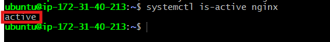,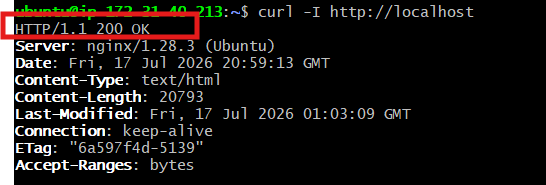

---

#### Screenshot 17 — Second `/linux-triage` output showing successful recovery with no FAIL results

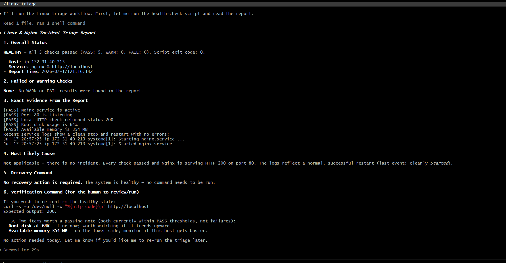

---

#### Screenshot 18 — Output of `ls -lah reports` showing both `incident-failure-report.txt` and `recovery-report.txt`

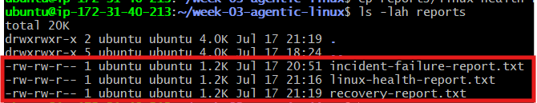

---

#### Screenshot 19 — `incident-summary.md` showing all required sections and your Full Name

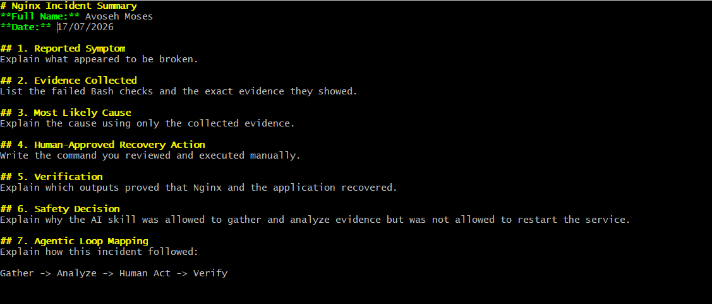

---

### Notes

Answer the following in your own words:

**1. What action did you execute manually?**

After reviewing the evidence and Claude's recommendation, I manually ran sudo systemctl start nginx, which started the Nginx service again and restored the web server.

---

**2. What evidence proves that the service recovered?**

The evidence that proves the service recovered is that systemctl is-active nginx returned active, and the local HTTP request returned HTTP/1.1 200 OK. In addition, the second /linux-triage run showed that the Nginx service, port 80, and HTTP checks all passed, confirming the service was successfully restored.

---

**3. Why is the second triage run necessary?**

The second triage run is necessary because starting Nginx alone does not confirm that the entire application is healthy. Running the triage script again verifies the service status, port 80, HTTP response, disk usage, and memory to ensure the server has fully recovered and returned to a healthy state.

---

**4. What could go wrong if an AI agent automatically restarted every failed service?**

If an AI agent automatically restarted every failed service, it could hide the underlying cause of the failure, such as a configuration error, resource shortage, or dependency issue. This could lead to repeated restart loops, make troubleshooting more difficult, or even worsen the incident. Reviewing the evidence first helps ensure that the correct and safest action is taken.

---

**5. In one sentence, explain the difference between using AI as a chatbot and using AI in this agentic workflow.**

A chatbot only answers questions, while in this agentic workflow, Claude uses tools to gather and analyze real server evidence and recommends actions, but I remain responsible for approving and performing the recovery steps.

---

# Incident Summary

Fill in all seven sections below in your own words.

**Full Name:** Avoseh Moses

**Date:** 17/07/2026

---

**1. Reported Symptom**

The web application was unavailable because Nginx was not serving traffic correctly during the incident simulation.

---

**2. Evidence Collected**

The /linux-triage script collected evidence showing the Nginx service status, port 80 availability, HTTP response, disk usage, memory usage, and recent logs. The failed checks identified that the service was not operating normally.

---

**3. Most Likely Cause**

The most likely cause was that the Nginx service had stopped, preventing the application from responding to HTTP requests.

---

**4. Human-Approved Recovery Action**

After reviewing the evidence and Claude’s recommendation, I manually ran sudo systemctl start nginx to restart the Nginx service.

---

**5. Verification**

The recovery was verified when systemctl is-active nginx returned active, the local HTTP request returned HTTP/1.1 200 OK, and the second /linux-triage run showed that the service, port, and HTTP checks passed.

---

**6. Safety Decision**

The recovery action was performed manually after reviewing evidence because automatically restarting services could hide the root cause or create repeated failures. Human approval ensured the action was safe and appropriate.

---

**7. Agentic Loop Mapping**

The workflow followed the agentic loop: observe (collect server evidence with the Bash script), reason (Claude analyzed the report and identified the issue), act (I manually restarted Nginx), and verify (the second triage run confirmed recovery).

---

# LinkedIn Post (Required)

## Evidence

#### LinkedIn Post URL

Paste your LinkedIn post URL here:

`https://www.linkedin.com/posts/moses-avoseh_built-an-ai-assisted-linux-health-check-workflow-share-7483998667289374720-M5qu/?utm_source=share&utm_medium=member_desktop&rcm=ACoAACZiz20BSL2chCMaU_0WK_2_7qktttgciMQ`
`Add your URL here`

---

#### Screenshot — Published LinkedIn post

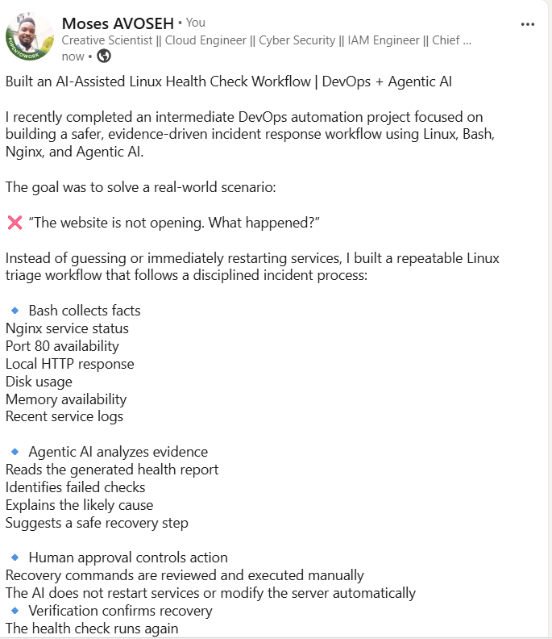

---

# GitHub Repository URL

Paste the URL of your GitHub folder or repository containing the assignment files here:

`https://github.com/DMIC3-G3-Avoseh-Moses/devops-micro-internship-pravinmishra.git`

---

# Submission Instructions

- Add all required screenshots in your submission
- Full Name must be visible in required screenshots and the Bash report
- All written answers must be in your own words
- Do not expose sensitive information (keys, passwords, AWS account IDs, tokens)
- GitHub URL must be included in this document

---

# Completion Checklist

- [✅ Completed] Task 1: Healthy baseline confirmed, workspace created (Screenshots 1–2, Notes answered)
- [✅ Completed] Task 2: CLAUDE.md created with all four sections (Screenshot 3, Notes answered)
- [✅ Completed] Task 3: Five-check plan produced by Claude using read-only tools (Screenshot 4, Notes answered)
- [✅ Completed] Task 4: `linux-triage.sh` created, syntax validated, executable permission set (Screenshots 5–8, Notes answered)
- [✅ Completed] Task 5: Healthy-state report generated with no FAIL result (Screenshots 9–10, Notes answered)
- [✅ Completed] Task 6: `/linux-triage` skill created and run successfully on healthy server (Screenshots 11–12, Notes answered)
- [✅ Completed] Task 7: Nginx incident simulated, failed evidence captured, Claude did not execute recovery (Screenshots 13–15, Notes answered)
- [✅ Completed] Task 8: Nginx recovered manually, recovery verified, reports saved, incident summary complete (Screenshots 16–19, Notes answered)
- [✅ Completed] Incident summary contains all seven required sections
- [✅ Completed] LinkedIn post published and URL submitted
- [✅ Completed] Full Name visible in all required screenshots and the Bash report
- [✅ Completed] Skill does not have Write permission
- [✅ Completed] Skill did not execute any recovery commands
- [✅ Completed] No sensitive data exposed

---

## 📌 About DMI & CloudAdvisory

DevOps Micro Internship (DMI) is a project-based DevOps program run by Pravin Mishra (The CloudAdvisory) focused on real-world execution, systems thinking, and career readiness.

It helps learners build strong DevOps foundations with hands-on experience.

---

## 📌 Resources

- 🌐 DMI Official Website: https://pravinmishra.com/dmi  
- 🎓 DevOps for Beginners (Udemy): https://www.udemy.com/course/devops-for-beginners-docker-k8s-cloud-cicd-4-projects/  
- 🎓 Agentic AI DevOps with Claude Code: https://www.udemy.com/course/ultimate-agentic-ai-devops-with-claude-code/  
- 🎓 DevOps with Claude Code: Terraform, EKS, ArgoCD & Helm: https://www.udemy.com/course/devops-with-claude-code-terraform-eks-argocd-helm/  
- ▶️ YouTube Playlist: https://www.youtube.com/playlist?list=PLFeSNDtI4Cho  
- 🔗 Pravin Mishra (LinkedIn): https://www.linkedin.com/in/pravin-mishra-aws-trainer/  
- 🏢 CloudAdvisory (LinkedIn): https://www.linkedin.com/company/thecloudadvisory/

---

*This submission is part of DevOps Micro Internship (DMI) Cohort 3 — Agentic AI Track.*