# Assignment 4 — Gotto Job: Backlog Refinement & Sprint 1 in Jira

Part of the DevOps Micro Internship (DMI) Cohort 3 with Agentic AI

---

## Purpose

In this 90-minute, time-boxed exercise, you will act as a Scrum team — or run in Solo Mode, playing every role yourself — to turn the Gotto Job template into a value-ordered backlog, estimate the work in story points, plan Sprint 1, open the burndown chart, and ship one small UI-only increment (text, color, spacing, a label, or a CTA — no backend changes).

---

# Task 1 — Roles & Mode Setup (Team vs Solo)

## Goal

Choose Team Mode or Solo Mode, and document how each Scrum role (Product Owner, Scrum Master, Dev Lead, DevOps Lead) was handled.

### Evidence

#### Screenshot 1 — Jira "Create project" screen, or the project sidebar after creation

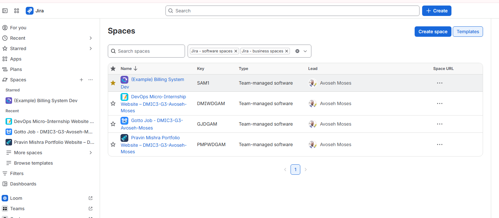

---

### Notes

Write one line for each role: PO (what you prioritized), SM (how you ensured process), Dev Lead (what you built), DevOps Lead (how you shipped).

PO (Product Owner): Responsible for deciding what has the most value and should be prioritized in the backlog — in 

Solo Mode, this means personally ranking the Stories by business/user value in Task 4.

SM (Scrum Master): Responsible for ensuring the process is followed correctly — timeboxing, sprint ceremonies (planning, retro), and keeping the team (or yourself) accountable to Scrum practices.

Dev Lead: Responsible for what gets built — the actual implementation of the chosen UI Story in Task 8.

DevOps Lead: Responsible for how it gets shipped — committing, deploying, and verifying the change is live.

---

# Task 2 — Create the Jira Project (Team-managed → Scrum)

## Goal

Create a Team-managed Scrum project named `Gotto Job – Team <#>` (Team Mode) or `Gotto Job – <YourName>` (Solo Mode).

### Evidence

#### Screenshot 2 — Project created page showing the project name and key

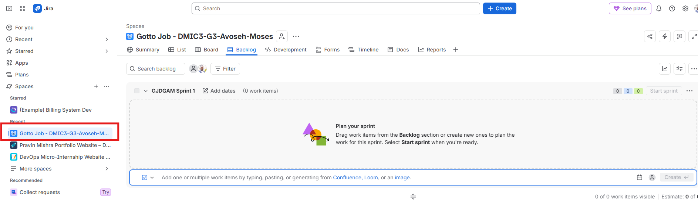

---

# Task 3 — Create the Epic

## Goal

Create the Epic `Improve Gotto Job UI discoverability & trust` to group the UI improvement initiative.

### Evidence

#### Screenshot 3 — Backlog showing the Epic panel with the Epic visible

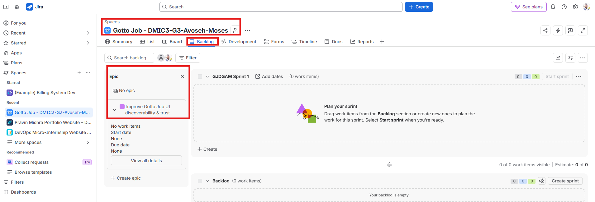

---

# Task 4 — Seed the Product Backlog (6–8 Stories + Fibonacci Points + Ranking)

## Goal

Create at least six Stories under the Epic, estimate each with 1, 2, or 3 story points, and rank them by value.

### Evidence

#### Screenshot 4 — Backlog showing the Epic and at least six Stories under it

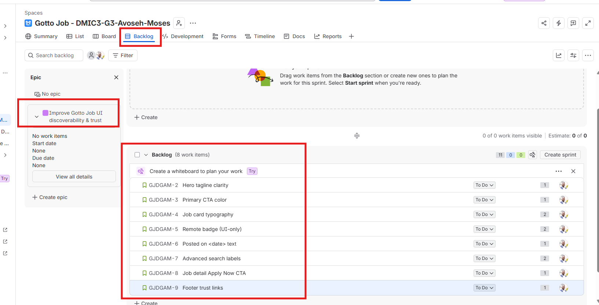

---

#### Screenshot 5 — One Story opened showing its Story Points and acceptance criteria filled in

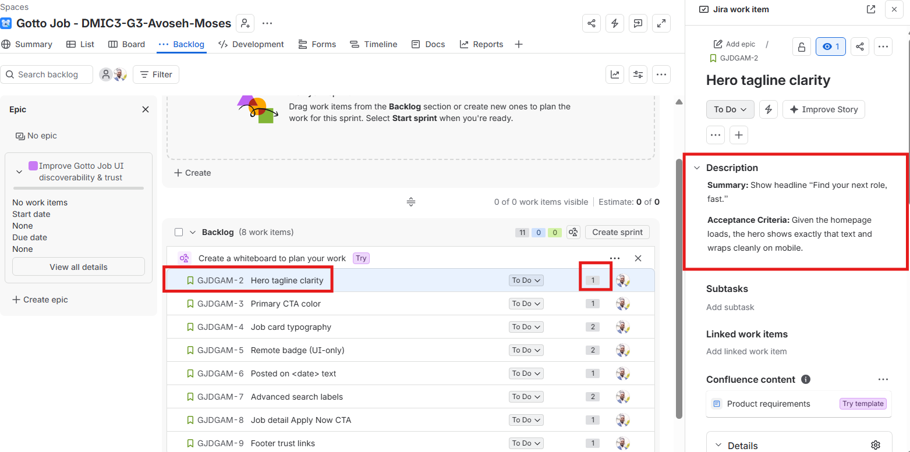

---

# Task 5 — Planning Poker (Estimate + Debate Notes)

## Goal

Confirm the Story Points (1, 2, or 3) for each Story and record brief reasoning for each estimate.

### Evidence

#### Screenshot 6 — Backlog showing Story Points visible, or two or three Stories opened showing their points

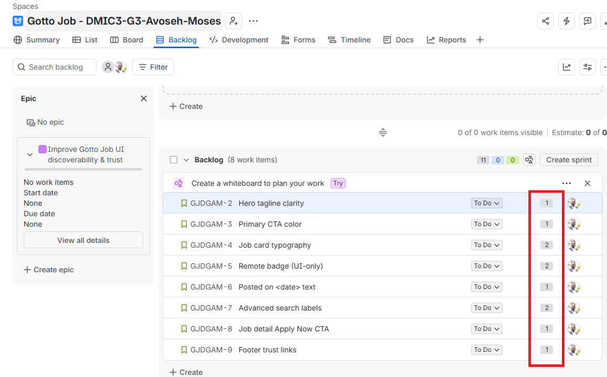

---

### Notes

For each story, explain in one or two lines why it is a 1, 2, or 3 (mention any debate, even in Solo Mode).

## Story Point Estimation Based on Complexity and Effort

S1 – Hero Tagline (1 point):
This is a straightforward content update involving only one heading. Since it requires minimal effort and no functional changes, I estimated it at 1 point.

S2 – Button Colour (1 point):
The task involves a simple CSS adjustment to change the button colour. Although several buttons may be affected, the change is still quick and requires no additional functionality, so I assigned 1 point.

S3 – Job Card Typography (2 points):
This requires updating the font size and weight across the job cards and then checking that the changes do not negatively affect the layout. The additional visual testing makes it slightly more involved, so I estimated 2 points.

S4 – REMOTE Badge (2 points):
Adding the REMOTE badge requires more than simply changing existing text because it must be displayed appropriately for remote positions. The additional styling and conditional display make this a 2-point task.

S5 – Posted On Date (1 point):
This is a small content update that adds a posted date to the job listing. It does not require any complex logic or major layout changes, so 1 point is appropriate.

S6 – Search Labels (2 points):
Several labels and placeholder texts need to be updated, followed by testing to make sure the search interface remains clear and functional. Because multiple elements are involved, I estimated this task at 2 points.

S7 – Job Detail “Apply Now” Button (1 point):
This involves adding a single button and connecting it to an email address or placeholder link. Since there is no additional application logic or complex functionality, I estimated it at 1 point.

S8 – Footer Trust Links (1 point):
This task adds two simple links, such as “About” and “Contact,” to the footer. It only requires a small HTML change and does not introduce any complex functionality, so I assigned 1 point.

---

# Task 6 — Sprint Planning: Create Sprint 1 + Sprint Goal + Scope

## Goal

Create Sprint 1, move three or four Stories into it (approximately 3–6 points), set the Sprint Goal, and break each selected Story into Build, Verify, Deploy, and Screenshot Sub-tasks.

### Evidence

#### Screenshot 7 — Sprint 1 with the selected Stories inside it

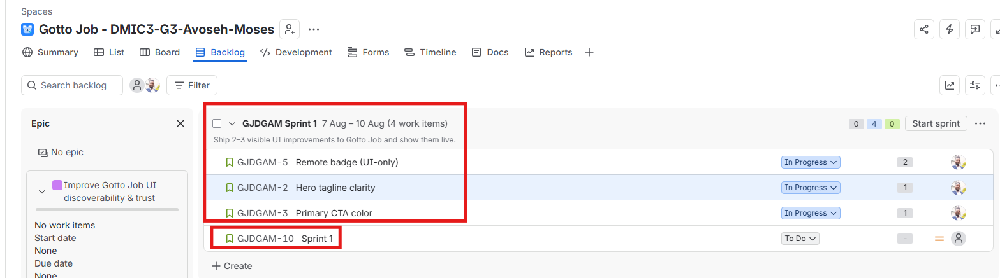

---

#### Screenshot 8 — One Story showing the Sub-tasks created

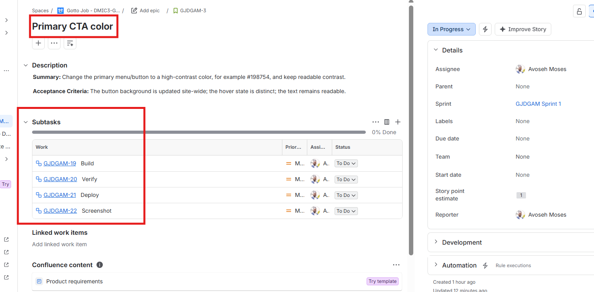

---

# Task 7 — Reports: Open Burndown Chart

## Goal

Open the Burndown Chart and confirm it exists for Sprint 1. It is acceptable if the chart is not yet populated.

### Evidence

#### Screenshot 9 — Burndown Chart page opened, even if empty

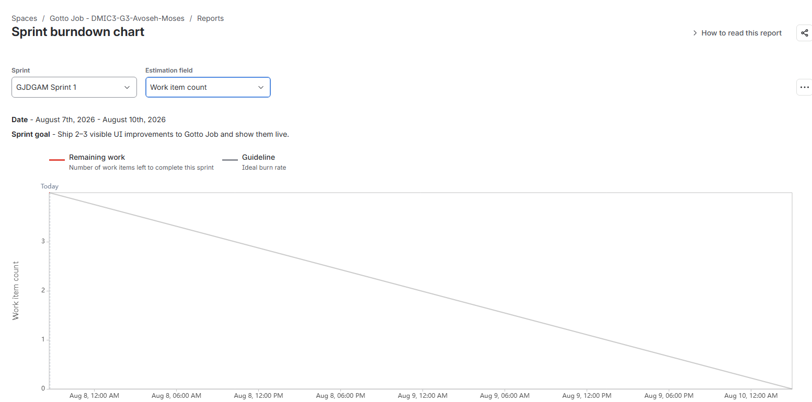

---

# Task 8 — Ship One Small Increment (Build + Deploy + Proof)

## Goal

Implement one small UI-only Story from Sprint 1, commit it, deploy it live, and move the Story and its Sub-tasks to Done in Jira.

### Evidence

#### Screenshot 10 — Jira board showing the Story moved to Done

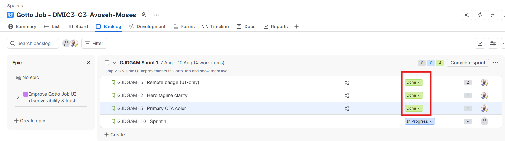

---

#### Screenshot 11 — Git commit output

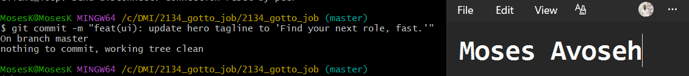

---

#### Screenshot 12 — Live URL in the browser showing the UI change, with the URL visible

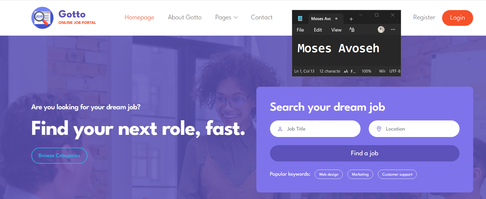

---

# Task 9 — Retro Notes (Scrum Pillar + Value)

## Goal

Add a retro comment covering what went well, what to improve, one Scrum pillar observed (Transparency, Inspection, or Adaptation), and one Scrum value (Openness, Focus, Commitment, Courage, or Respect).

### Evidence

#### Screenshot 13 — Jira retro comment visible

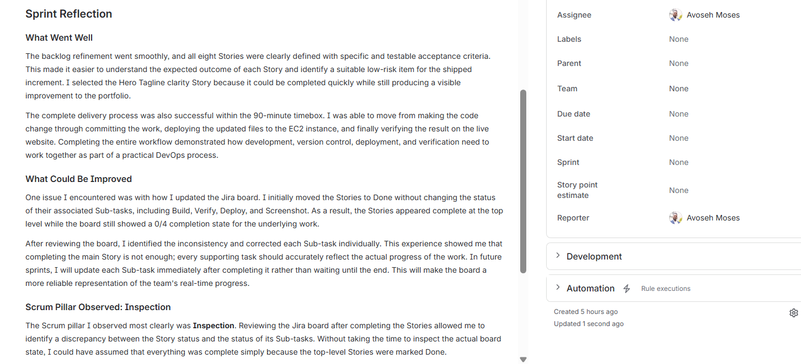

---

# Task 10 — LinkedIn Post (Mandatory)

## Goal

Publish a LinkedIn post about what you delivered, including your live URL, three to five lines on what you did and learned, and one screenshot (Burndown Chart, Sprint board, or the live UI change).

## Evidence

#### LinkedIn Post URL

Paste your LinkedIn post URL here:

`https://www.linkedin.com/posts/moses-avoseh_from-backlog-refinement-to-a-live-ui-release-share-7491650991541473281-LC16/?utm_source=share&utm_medium=member_desktop&rcm=ACoAACZiz20BSL2chCMaU_0WK_2_7qktttgciMQ`

---

#### Screenshot 14 — Published LinkedIn post

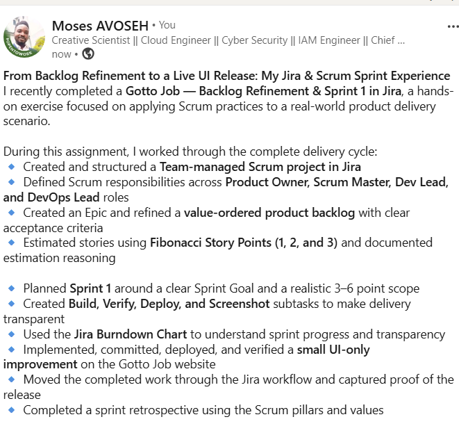

---

# Submission Instructions

- Add all 14 required screenshots
- Full name must be visible in required screenshots
- Do not expose sensitive information (keys, passwords, account IDs)

---

# Completion Checklist

- [✅ Completed] Task 1: Team Mode or Solo Mode selected and all four roles documented (Screenshot 1 & Notes)
- [✅ Completed] Task 2: Team-managed Scrum project created with the required name (Screenshot 2)
- [✅ Completed] Task 3: UI improvement Epic created (Screenshot 3)
- [✅ Completed] Task 4: 6–8 Stories added under the Epic and ranked by value (Screenshots 4 & 5)
- [✅ Completed] Task 5: Story Points set (1, 2, or 3) with reasoning recorded (Screenshot 6 & Notes)
- [✅ Completed] Task 6: Sprint 1 created with Sprint Goal, 3–4 Stories, and Sub-tasks (Screenshots 7 & 8)
- [✅ Completed] Task 7: Burndown Chart opened (Screenshot 9)
- [✅ Completed] Task 8: One UI-only increment implemented, committed, deployed, and verified (Screenshots 10–12)
- [✅ Completed] Task 9: Retro comment with one Scrum pillar and one Scrum value (Screenshot 13)
- [✅ Completed] Task 10: Mandatory LinkedIn post published with the live URL, backlog refinement, Sprint planning, one shipped increment, proof, and Screenshot 14
- [✅ Completed] Full Name visible in required screenshots
- [✅ Completed] No sensitive data exposed

---

## 📌 About DMI & CloudAdvisory

DevOps Micro Internship (DMI) is a project-based DevOps program run by Pravin Mishra (The CloudAdvisory) focused on real-world execution, systems thinking, and career readiness.

It helps learners build strong DevOps foundations with hands-on experience.

---

## 📌 Resources

- 🌐 DMI Official Website: https://dmi.pravinmishra.com?utm_source=github&utm_medium=readme  
- 🎓 University: https://university.pravinmishra.com?utm_source=github&utm_medium=readme  
- 💬 Discord Community: https://discord.pravinmishra.com?utm_source=github&utm_medium=readme  
- 📝 Blog: https://dmi.pravinmishra.com/blog?utm_source=github&utm_medium=readme  
- ▶️ YouTube Playlist: https://www.youtube.com/playlist?list=PLFeSNDtI4Cho  
- 🔗 Pravin Mishra (LinkedIn): https://www.linkedin.com/in/pravin-mishra-aws-trainer/  
- 🏢 CloudAdvisory (LinkedIn): https://www.linkedin.com/company/thecloudadvisory/

---

*This submission is part of DevOps Micro Internship (DMI) Cohort 3 — Agentic AI Track.*
