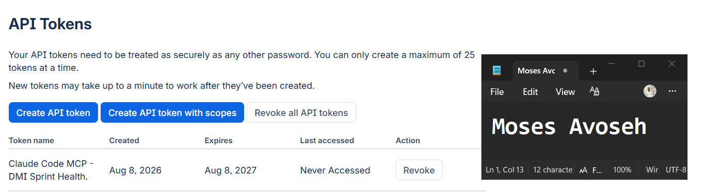
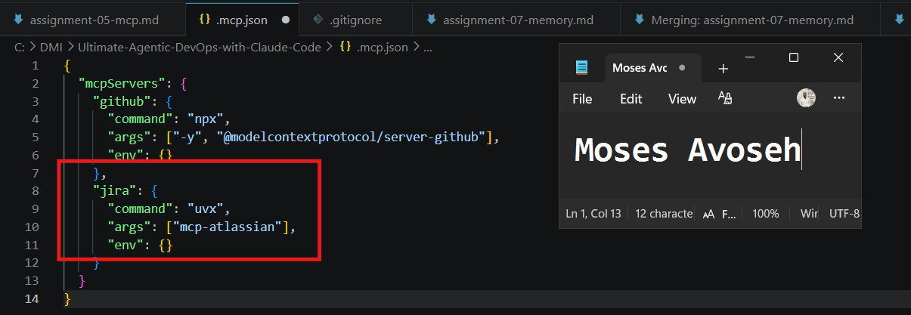
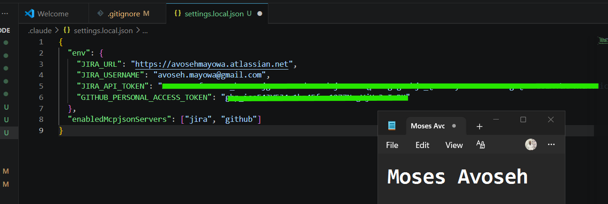
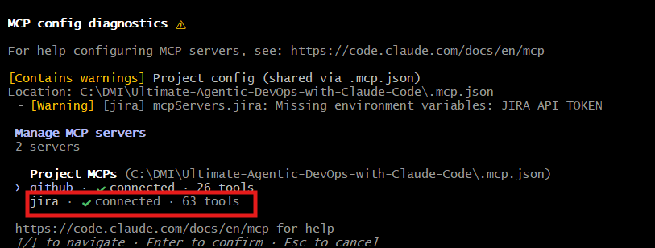
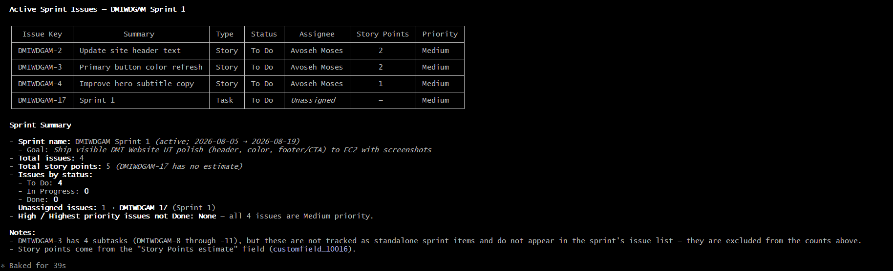
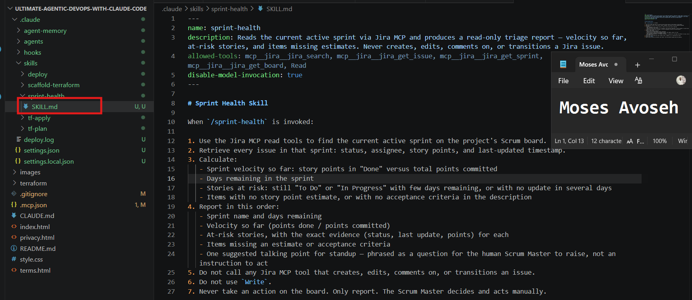
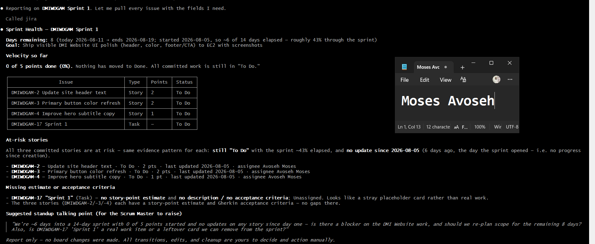
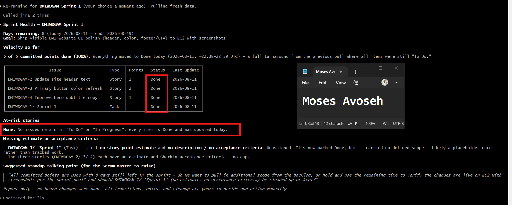

# Assignment 5 — AI-Assisted Sprint Health Report via Jira MCP

Part of the DevOps Micro Internship (DMI) Cohort 3 with Agentic AI

---

## Purpose

In this assignment, you will connect Claude Code to your Jira board through an MCP server, the same way you connected it to GitHub in Week 2, and build a read-only `/sprint-health` skill. The skill reads your current sprint through Jira's API and reports sprint velocity, stories at risk of missing the sprint, and items missing an estimate — but it must never create, edit, comment on, or transition a single ticket itself. You will prove that boundary holds by making a real change on the board yourself and confirming the skill only ever reports, never acts.

---

# Task 1 — Create a Jira API Token

## Goal

Generate an API token from your Atlassian account that the MCP server will use to authenticate with your Jira site. Do not screenshot the token value itself.

### Evidence

#### Screenshot 1 — Jira API token creation confirmation page showing the token name, with the token value not visible

### Notes You Must Write (Very Important):

Why does the MCP server need your site URL and account email in addition to the token?

The site URL tells the MCP server where to connect.
The account email identifies which account the token belongs to.
The token proves that you’re authorized to access that account.
Depending on the MCP server, the email may be redundant if the token already identifies your account.

---

# Task 2 — Create .mcp.json at the Project Root

## Goal

Create or update `.mcp.json` at your project root with a Jira MCP server block, following the same shape as the GitHub MCP server you configured in Week 2.

### Evidence

#### Screenshot 2 — `.mcp.json` open in VS Code showing the Jira server configuration

### Notes You Must Write (Very Important):

Compare this jira block to the github block from Week 2 Assignment 5. The GitHub server ran via npx (a Node.js package); this one runs via uvx (a Python package) — what stays exactly the same shape despite that difference, and why doesn't Claude Code care which language a given MCP server is written in?

Both use the same mcpServers → server name → command → args → env structure.
GitHub uses npx, while Jira uses uvx to start its respective MCP package.
Claude Code only reads the configuration and starts the specified command; it doesn't care what language the server uses.
The MCP protocol provides the common interface, so Node.js and Python servers work the same way.

---

# Task 3 — Add Your Credentials to settings.local.json

## Goal

Add your Jira site URL, account email, and API token to `.claude/settings.local.json`, and confirm that file is listed in `.gitignore` so it is never committed.

### Evidence

#### Screenshot 3 — `settings.local.json` open in VS Code showing the `env` section, with the actual token value blurred or covered

### Notes You Must Write (Very Important):

Why must JIRA_API_TOKEN live in settings.local.json and never in .mcp.json?

settings.local.json is for local, sensitive configuration such as JIRA_API_TOKEN.
It should be added to .gitignore so credentials are never committed or pushed to GitHub.
.mcp.json is project-level configuration and may be shared or committed to the repository.
Keeping secrets out of .mcp.json prevents accidental credential exposure and improves security.

---

# Task 4 — Verify the Connection with /mcp

## Goal

Restart Claude Code and confirm the Jira MCP server shows as connected.

### Evidence

#### Screenshot 4 — `/mcp` output showing `jira: connected`

---

# Task 5 — Run a Live Query to Prove Real Board Data

## Goal

Ask Claude to list the issues in your current active sprint through the Jira MCP connection, and confirm the result matches what you see on your live board in the browser.

### Evidence

#### Screenshot 5 — Claude's response showing the live sprint issue list retrieved via Jira MCP

### Notes You Must Write (Very Important):

How did you confirm this was real board data and not something Claude guessed?

This task demonstrates that the Jira MCP server is able to retrieve real-time project information directly from Jira rather than relying on assumptions or generated data.

When the request is submitted, Claude passes it to the Jira MCP server. The MCP server uses the configured Jira site, account credentials, and API token to authenticate and communicate with Jira’s REST API. It then retrieves information about the currently active sprint and sends the results back to Claude for processing.

Claude organizes the returned information into an easy-to-read report containing the sprint details, issues included in the sprint, their current statuses, assigned team members, story points, priorities, and a summary of the sprint.

This confirms that the MCP integration is working correctly and that the information displayed is based on the actual, current state of the Jira project rather than assumptions or manually entered data.

---

# Task 6 — Build the /sprint-health Skill

## Goal

Create a `/sprint-health` skill restricted to read-only Jira tools plus `Read`, with no issue-mutating tools and no `Write`. Run it and confirm it produces a report covering sprint velocity, at-risk stories, and items missing an estimate.

### Evidence

#### Screenshot 6 — `SKILL.md` frontmatter showing `allowed-tools` limited to read-only Jira tools plus `Read`, with `disable-model-invocation: true`

#### Screenshot 7 — `/sprint-health` output showing the full triage report against your real sprint

### Notes You Must Write (Very Important):

1. Which Jira MCP tools does this skill's allowed-tools list include, and which mutating tools (create issue, update issue, transition issue, add comment) does it deliberately exclude?

The skill allows only jira_search, jira_get_issue, jira_get_sprint, jira_get_board, and the Read tool.
These tools are limited to retrieving and analyzing Jira information without making changes.
It deliberately excludes tools for creating, editing, transitioning, or commenting on issues.
This keeps /sprint-health strictly read-only and prevents accidental changes to the Jira project.

2. Why does a Scrum Master need this restriction more than almost any other role in this course?

A Scrum Master needs accurate project visibility without unintentionally changing the team's Jira data.
The read-only restriction allows them to inspect sprint progress, identify risks, and highlight planning gaps safely.
It prevents automated actions from altering issues, statuses, assignments, or team decisions without approval.
This supports transparency, accountability, and the Scrum Master's role as a facilitator rather than a direct project editor.

---

# Task 7 — Prove the Skill Never Mutates the Board

## Goal

Manually update one ticket on your board in the browser (for example, move a story to "Done" or add a missing estimate), then run `/sprint-health` again and confirm the new report reflects your change — proving the skill only ever reads live state and never wrote to the board itself.

### Evidence

#### Screenshot 8 — Second `/sprint-health` run showing the report now reflects your manual board change

### Notes You Must Write (Very Important):

Map this assignment to Gather → Analyze → Human Act → Verify from Week 3 Assignment 6. Which step did you perform manually in the browser, and why must that step stay human?

The assignment follows the Week 3 workflow of Gather → Analyze → Human Act → Verify.
Gather involved retrieving the live Jira sprint information, while Analyze involved reviewing the sprint data and identifying risks or gaps.
The Human Act step was performed manually in the Jira browser by the Scrum Master.
This step must remain human because decisions such as changing statuses, assigning work, or updating issues require judgment and team approval.
Finally, Verify confirms that the information and any approved changes accurately reflect the current state of the Jira project.

---

# Submission Instructions

Complete all tasks in sequence.

Your submission must include:
- All 8 required screenshots
- All the required notes

---

# Completion Checklist

- [✅ Completed] Task 1: Jira API token created, value never screenshotted (Screenshot 1)
- [✅ Completed] Task 2: `.mcp.json` has the Jira server block (Screenshot 2)
- [✅ Completed] Task 3: Credentials stored in `settings.local.json`, token blurred, file gitignored (Screenshot 3)
- [✅ Completed] Task 4: `/mcp` shows the Jira server connected (Screenshot 4)
- [✅ Completed] Task 5: Live query returned real sprint data, verified against the browser (Screenshot 5)
- [✅ Completed] Task 6: `/sprint-health` skill created with correct read-only `allowed-tools`, and produced a full report (Screenshots 6–7)
- [✅ Completed] Task 7: A manual board change was reflected in a second `/sprint-health` run (Screenshot 8)
- [✅ Completed] Skill never created, edited, transitioned, or commented on any issue
- [✅ Completed] Reflection answered (Notes)
- [✅ Completed] No API token value exposed

---

## 📌 About DMI & CloudAdvisory

DevOps Micro Internship (DMI) is a project-based DevOps program run by Pravin Mishra (The CloudAdvisory) focused on real-world execution, systems thinking, and career readiness.

It helps learners build strong DevOps foundations with hands-on experience.

---

## 📌 Resources

- 🌐 DMI Official Website: https://dmi.pravinmishra.com?utm_source=github&utm_medium=readme  
- 🎓 University: https://university.pravinmishra.com?utm_source=github&utm_medium=readme  
- 💬 Discord Community: https://discord.pravinmishra.com?utm_source=github&utm_medium=readme  
- 📝 Blog: https://dmi.pravinmishra.com/blog?utm_source=github&utm_medium=readme  
- ▶️ YouTube Playlist: https://www.youtube.com/playlist?list=PLFeSNDtI4Cho  
- 🔗 Pravin Mishra (LinkedIn): https://www.linkedin.com/in/pravin-mishra-aws-trainer/  
- 🏢 CloudAdvisory (LinkedIn): https://www.linkedin.com/company/thecloudadvisory/

---

*This submission is part of DevOps Micro Internship (DMI) Cohort 3 — Agentic AI Track.*
