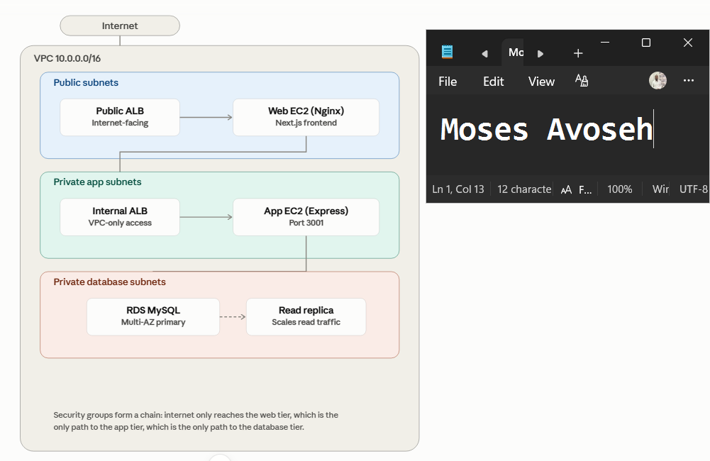
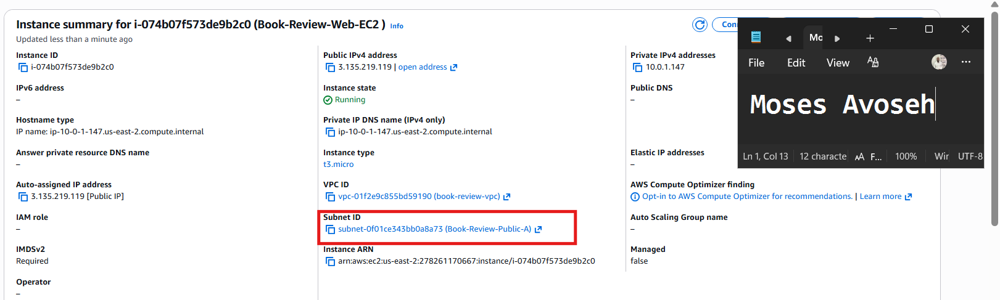
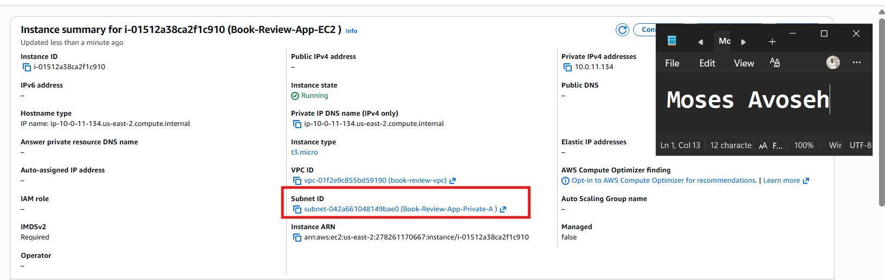
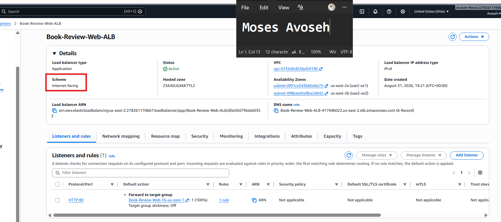
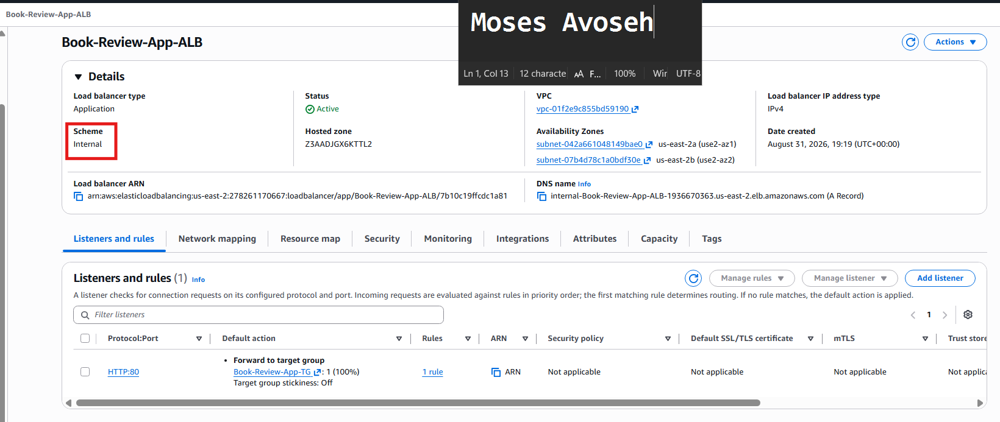
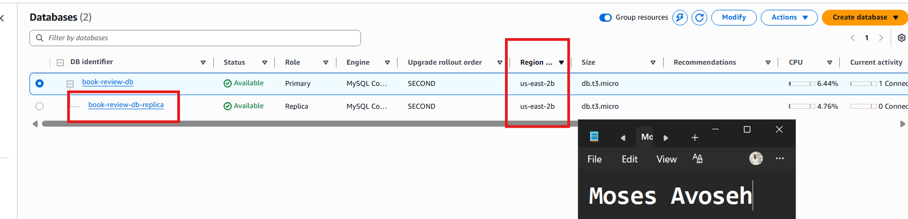
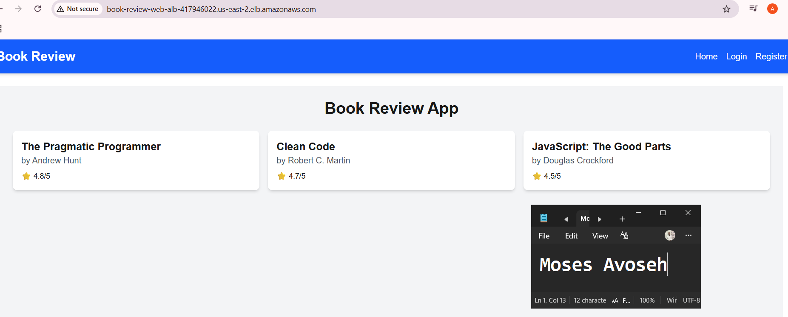
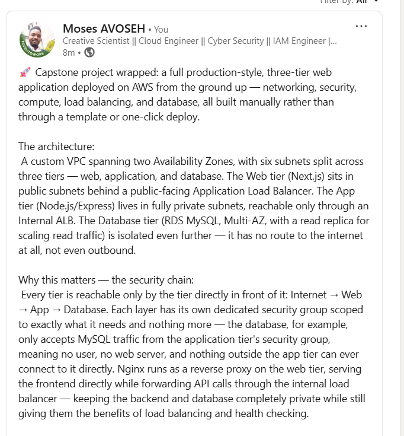

# Assignment 6 — Capstone: Deploy Book Review App (Three-Tier Architecture) on AWS

Part of the DevOps Micro Internship (DMI) Cohort 3 with Agentic AI

---

## Purpose

This is the most important assignment of the course. You will deploy the Book Review App in a fully production-style three-tier architecture on AWS: a Next.js Web Tier behind Nginx and a public ALB, a private Node.js/Express App Tier behind an internal ALB, and a private Multi-AZ MySQL RDS database with a read replica. You are expected to design, deploy, isolate, debug, and document the result independently.

---

# Task 1 — Architecture Diagram

## Goal

Create an architecture diagram showing the custom VPC (10.0.0.0/16), the six subnets across two Availability Zones (two public Web Tier, two private App Tier, two private Database Tier), the public ALB, Web Tier EC2/Nginx, internal ALB, private App Tier EC2, private Multi-AZ RDS with its read replica, and the permitted traffic flow.

### Evidence

#### Diagram image or link

---

# Task 2 — AWS Region & Services Used

## Goal

Record the AWS Region used and list every AWS service used across networking, compute, load balancing, security, and the database.

### Notes

**Region:**

US East (Ohio) — us-east-2

---

**Services used:**

# Task 2 — AWS Region & Services Used

## Goal

Record the AWS Region used and list every AWS service used across networking, compute, load balancing, security, and the database.

### Notes

**Region:** US East (Ohio) — us-east-2

Services Used:

Networking:
- Amazon VPC (Book-Review-VPC) — custom virtual private cloud with 6 subnets across 2 Availability Zones (us-east-2a, us-east-2b)
- Internet Gateway — provides internet access to the public subnets
- NAT Gateway — provides outbound-only internet access for the private app subnets
- Elastic IP — static public IP address allocated for the NAT Gateway
- Route Tables — three separate tables (public, app-private, db-private) controlling traffic flow per tier

Compute:
- Amazon EC2 — two t3.micro instances:
  - Book-Review-Web-EC2 (public subnet, hosts Next.js frontend + Nginx)
  - Book-Review-App-EC2 (private subnet, hosts Node.js/Express backend)

Load Balancing:
- Application Load Balancer (ALB) — two instances:
  - Book-Review-Web-ALB (internet-facing, public-facing entry point)
  - Book-Review-App-ALB (internal, routes traffic privately to the backend)
- Target Groups — Book-Review-Web-TG and Book-Review-App-TG, used for health checks and routing

Security:
- Security Groups — three tiered groups enforcing least-privilege access:
  - Book-Review-Web-SG
  - Book-Review-App-SG
  - Book-Review-DB-SG

Database:
- Amazon RDS (MySQL) — book-review-db, deployed across two private database subnets
  - Multi-AZ configuration for high availability
  - Read Replica — book-review-db-replica, for offloading read traffic
  - DB Subnet Group — Book-Review-DB-Subnet-Group

Identity & Access:
- IAM — used for the Enhanced Monitoring role (RDS)

Process Management:
- PM2 (on EC2, not an AWS service, but part of the deployment) — keeps the frontend and backend processes running persistently and survives reboots via systemd integration

---

# Task 3 — Public Entry Point

## Goal

Confirm the Book Review App loads through the public ALB DNS name.

### Evidence

#### Public ALB DNS

Paste your public ALB DNS name here:

`Book-Review-Web-ALB-417946022.us-east-2.elb.amazonaws.com`

---

# Task 4 — Evidence Screenshots

## Goal

Capture visual proof of every tier and load balancer.

### Evidence

#### Screenshot 1 — Web Tier EC2 instance in a public subnet

---

#### Screenshot 2 — App Tier EC2 instance in a private subnet

---

#### Screenshot 3 — Public Application Load Balancer configuration or healthy targets

---

#### Screenshot 4 — Internal Application Load Balancer configuration or healthy targets

---

#### Screenshot 5 — Amazon RDS for MySQL showing Multi-AZ and the read replica

---

#### Screenshot 6 — Book Review App UI working through the public ALB

---

# Task 5 — Summary

## Goal

Summarize what worked in the final deployment, the issues encountered and how each was fixed, and the tools or sources used to research and debug.

### Notes

**What worked:**

# Task 5 — Summary

## Goal

Summarize what worked in the final deployment, the issues encountered and how each was fixed, and the tools or sources used to research and debug.

### Notes

**What worked:**

The full three-tier architecture is up and functioning end-to-end: a custom VPC spanning two Availability Zones, with the Web tier in public subnets and the App and Database tiers isolated in private subnets. The Public ALB successfully receives internet traffic and forwards it to the Web EC2 instance running Nginx, which acts as a reverse proxy — serving the Next.js frontend directly and forwarding `/api/*` requests through the Internal ALB to the private App EC2 instance running the Express backend. The backend connects securely to RDS MySQL over SSL, and both EC2 instances run their respective apps under PM2, configured to survive reboots via systemd. End-to-end functionality — browsing books, registering an account, logging in, viewing book details/reviews, and submitting a new review — all work correctly, both through the raw Web EC2 IP and through the Public ALB's DNS name.

---

**Issues encountered and fixes:**
1. **RDS "Unknown MySQL server host" error** — Initially connected using a placeholder endpoint copied directly from the assignment template rather than the project's actual RDS endpoint. Fixed by retrieving the real endpoint from the RDS console's Connectivity & Security tab.

2. **Hanging MySQL/SSH connections** — Multiple instances of this: RDS connection hung because `Book-Review-DB-SG` didn't allow inbound 3306 from the App tier's security group; SSH from the Web EC2 to the App EC2 hung because `Book-Review-App-SG` didn't allow inbound SSH from the Web tier. Fixed by adding explicit inbound rules sourced from the correct tier's security group in each case, rather than from an IP address.

3. **502 Bad Gateway from Nginx** — Caused by an incorrect Internal ALB hostname hardcoded in the Nginx config (again, a leftover template placeholder). Fixed by replacing it with the actual Internal ALB's DNS name copied from the console, then validating with `nginx -t` before reloading.

4. **503 Service Temporarily Unavailable from both ALBs** — Occurred twice, once per tier: the App and Web target groups both started with zero registered targets, since target group creation and instance registration are separate steps. Fixed by explicitly registering each EC2 instance with its respective target group (App EC2 → port 3001, Web EC2 → port 80) and waiting for health checks to pass.

5. **"No books available" / silent frontend failure** — The homepage loaded, but the book list never populated. Root cause was a path-doubling bug in the frontend source (`page.js`): `NEXT_PUBLIC_API_URL` was already set to `/api`, but the code appended a redundant `/api/books`, producing `/api/api/books`, a 404. Found using Chrome DevTools' Network tab, fixed by removing the duplicate `/api` segment, then rebuilding (`npm run build`) and restarting the PM2-managed frontend process — a reminder that Next.js bakes environment variables and code changes in at build time, not runtime.

6. **CORS "Not allowed by server" on registration** — The backend's `ALLOWED_ORIGINS` only included the Public ALB's DNS name and `localhost:3000`, not the raw Web EC2 public IP being used for initial testing. Fixed by adding the IP as an additional allowed origin, then restarting the backend with `pm2 restart book-review-backend --update-env` to force the updated environment variables to load.

7. **Browser-only connection timeouts** (encountered on a related project, same debugging pattern applied here) — Chrome and Edge both timed out reaching an ALB DNS name while `curl` succeeded from the same machine. Traced to a stale browser-level DNS host cache, not an actual AWS networking issue; resolved by clearing Chrome's internal DNS cache via `chrome://net-internals/#dns`.

---

**Tools/sources used:**

- AWS Console (EC2, VPC, RDS, Target Groups, Load Balancers, Security Groups) for direct configuration and verification at every layer
- SSH (via a bastion/jump-host pattern through the Web EC2) for all instance-level configuration and debugging
- `curl` for layer-by-layer isolation testing (localhost → Nginx → Internal ALB → backend), which was the single most effective debugging technique used throughout — it consistently narrowed down which exact layer was failing before touching the browser
- Chrome DevTools Network tab for diagnosing client-side/browser-only issues (the `/api/api/` path doubling and CORS errors) that weren't visible from server-side `curl` tests alone
- MySQL CLI client for direct database connectivity verification and inspection
- `nginx -t` for validating reverse proxy configuration before every reload, catching syntax and hostname errors before they caused downtime
- PM2 documentation/built-in help for process management, persistence, and systemd integration

---

# LinkedIn Post (Required)

## Goal

Publish a LinkedIn post sharing the capstone deployment, including the public ALB DNS (or a redacted screenshot), three to five lines on what you built and why it is production-style, and one proof screenshot.

## Evidence

#### LinkedIn Post URL

Paste your LinkedIn post URL here:

`https://www.linkedin.com/posts/moses-avoseh_capstone-project-wrapped-a-full-production-style-activity-7500652643036549120-VmsX?utm_source=share&utm_medium=member_desktop&rcm=ACoAACZiz20BSL2chCMaU_0WK_2_7qktttgciMQ`

---

#### Screenshot — Published LinkedIn post

---

# Submission Instructions

- Add all required screenshots and links in your submission
- Do not expose passwords, RDS credentials, connection strings, private keys, or account IDs

---

# Completion Checklist

- [✅ Completed] Task 1: Architecture diagram completed
- [✅ Completed] Task 2: AWS Region and services documented
- [✅ Completed] Task 3: Public ALB DNS confirmed working
- [✅ Completed] Task 4: All six evidence screenshots captured (Web Tier, App Tier, both ALBs, RDS + replica, app UI)
- [✅ Completed] Task 5: Deployment summary completed (what worked, issues/fixes, tools/sources)
- [✅ Completed] LinkedIn post published and URL submitted
- [✅ Completed] App Tier and Database Tier confirmed not publicly accessible
- [✅ Completed] No sensitive data exposed

---

## 📌 About DMI & CloudAdvisory

DevOps Micro Internship (DMI) is a project-based DevOps program run by Pravin Mishra (The CloudAdvisory) focused on real-world execution, systems thinking, and career readiness.

It helps learners build strong DevOps foundations with hands-on experience.

---

## 📌 Resources

- 🌐 DMI Official Website: https://dmi.pravinmishra.com?utm_source=github&utm_medium=readme  
- 🎓 University: https://university.pravinmishra.com?utm_source=github&utm_medium=readme  
- 💬 Discord Community: https://discord.pravinmishra.com?utm_source=github&utm_medium=readme  
- 📝 Blog: https://dmi.pravinmishra.com/blog?utm_source=github&utm_medium=readme  
- ▶️ YouTube Playlist: https://www.youtube.com/playlist?list=PLFeSNDtI4Cho  
- 🔗 Pravin Mishra (LinkedIn): https://www.linkedin.com/in/pravin-mishra-aws-trainer/  
- 🏢 CloudAdvisory (LinkedIn): https://www.linkedin.com/company/thecloudadvisory/

---

*This submission is part of DevOps Micro Internship (DMI) Cohort 3 — Agentic AI Track.*
