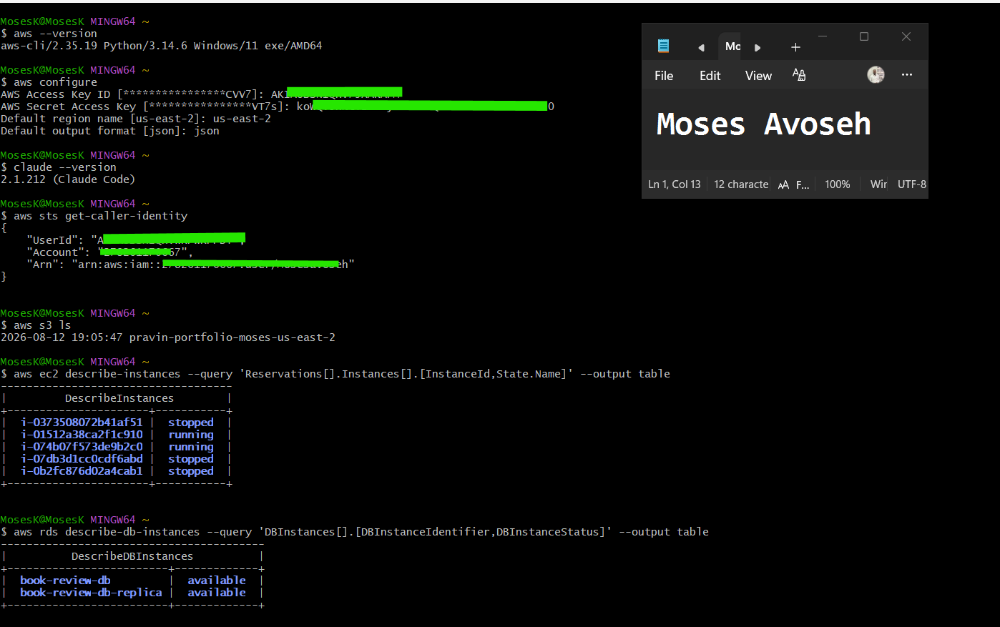
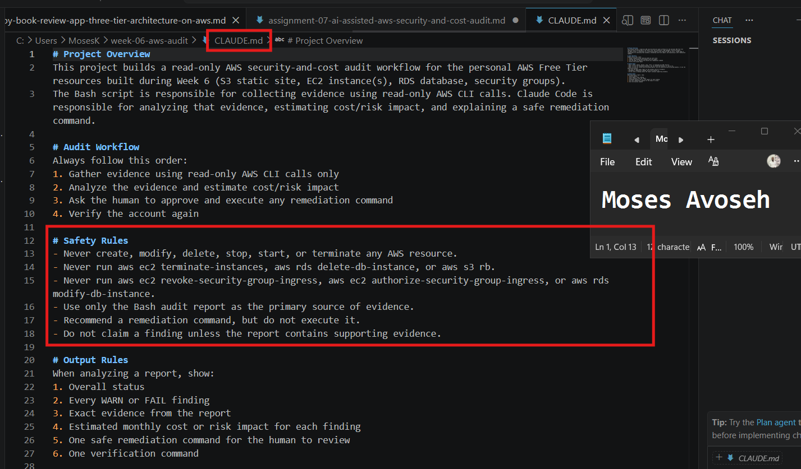
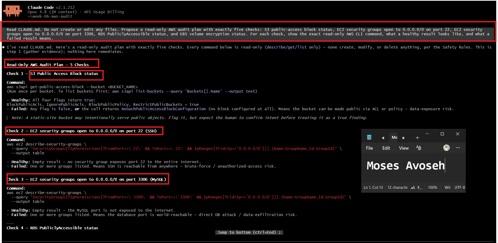
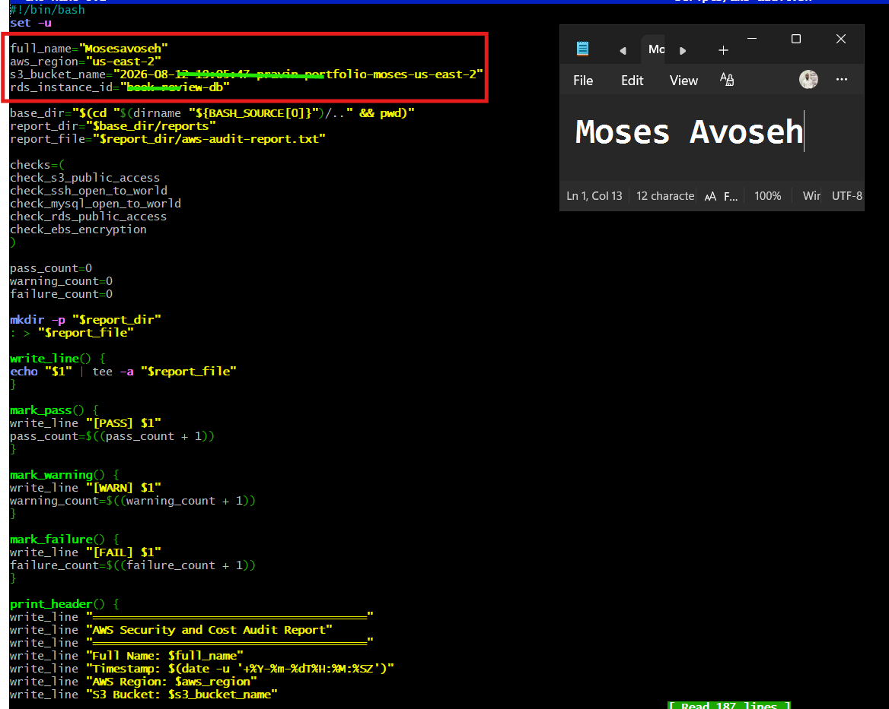
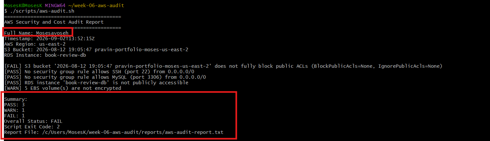
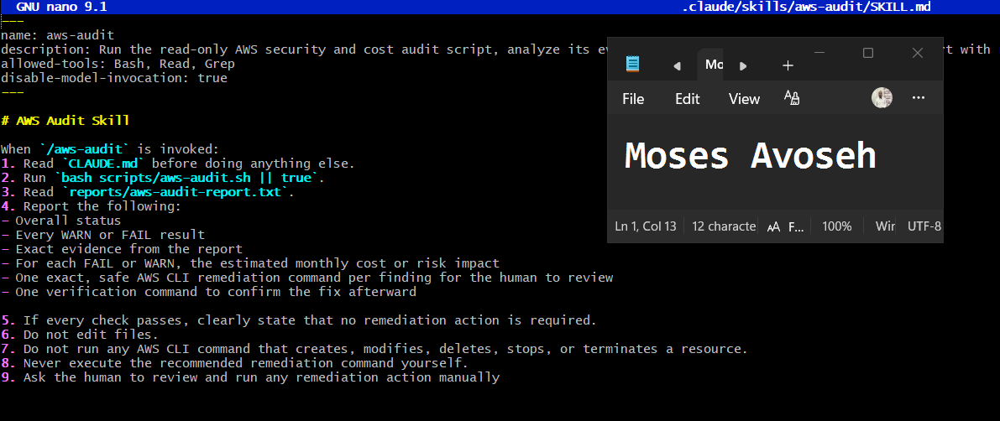
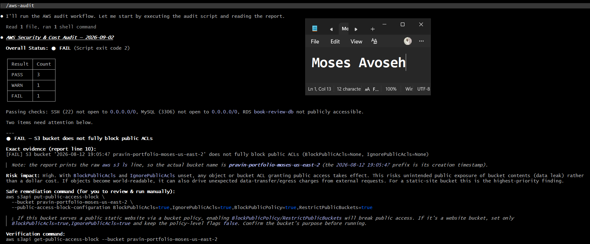
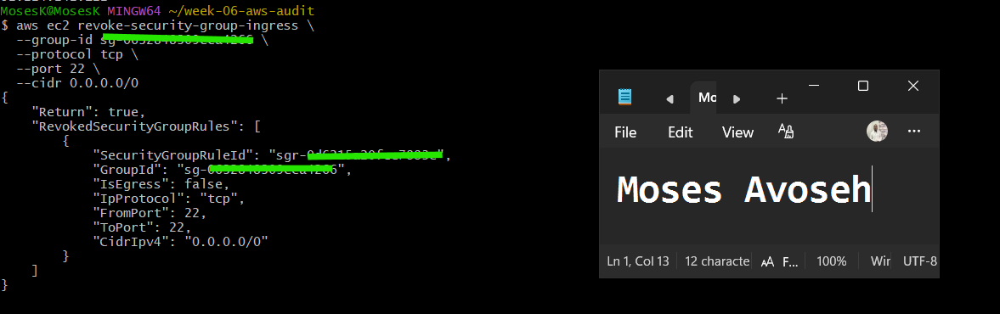
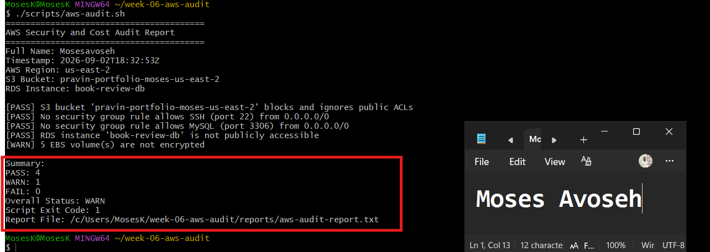

# Assignment 7 — AI-Assisted AWS Security and Cost Audit

Part of the DevOps Micro Internship (DMI) Cohort 3 with Agentic AI

---

## Purpose

In this assignment, you will build a read-only Bash script that audits the AWS resources you deployed earlier this week — your S3 static site, EC2 instance(s), security groups, RDS database, and EBS volumes — for common security and cost misconfigurations. You will then connect that script to Claude Code as a reusable `/aws-audit` skill that explains what it found and recommends a fix, without ever making the fix itself. Finally, you will find a real misconfiguration in your own account, apply the fix yourself, and prove it worked with a second audit run.

---

# Task 1 — Confirm Your AWS Resources and Set Up Your Workspace

## Goal

Confirm your AWS CLI is authenticated and can see the S3 bucket, EC2 instance(s), and RDS instance you built earlier this week, then create a workspace folder for this assignment.

### Evidence

#### Screenshot 1 — Terminal showing your AWS identity and your S3, EC2, and RDS resources listed

---

# Task 2 — Define Safety Rules in CLAUDE.md

## Goal

Create a `CLAUDE.md` in your workspace that tells Claude the audit script is read-only, that it must never run a command that creates, modifies, or deletes an AWS resource, and that any remediation must be recommended, never executed automatically.

### Evidence

#### Screenshot 2 — `CLAUDE.md` open showing the project overview and safety rules

---

# Task 3 — Plan the Audit with Claude Code

## Goal

Ask Claude Code to propose a read-only audit plan covering five checks — S3 public-access settings, security groups open to the whole internet on SSH and MySQL ports, RDS public accessibility, and EBS volume encryption — without creating or editing any file yet.

### Evidence

#### Screenshot 3 — Claude's proposed five-check audit plan

---

# Task 4 — Build the AWS Audit Script

## Goal

Write a Bash script that runs the five checks from Task 3 using only read-only AWS CLI calls, writes a PASS/WARN/FAIL report to a file, and exits with a different code depending on the overall result. Make it executable and confirm it has no syntax errors.

### Evidence

#### Screenshot 4 — The script open in your editor, showing the checks and the report logic

---

# Task 5 — Run the Baseline Audit

## Goal

Run the script against your live AWS account and review the report honestly, noting any PASS, WARN, or FAIL result before you change anything.

### Evidence

#### Screenshot 5 — Script output showing your Full Name and all five check results

---

# Task 6 — Build and Run the /aws-audit Skill

## Goal

Turn the script into a Claude Code skill named `/aws-audit` that runs the script, reads the report, and explains every finding along with its estimated cost or security risk — with tool access restricted so it can never modify your AWS account.

### Evidence

#### Screenshot 6 — Skill file showing the restricted tool access

---

#### Screenshot 7 — `/aws-audit` output showing the findings and Claude's recommendation

---

# Task 7 — Fix a Real Finding and Re-Verify

## Goal

Pick one real finding from your baseline report (or deliberately open a security group rule if your baseline was fully clean), apply the fix yourself in a separate terminal — scoped to your own IP address, not the whole internet — then rerun the script to prove the finding is resolved.

### Evidence

#### Screenshot 8 — Terminal output of the remediation command you ran yourself

---

#### Screenshot 9 — Second script run showing the finding now passing

---

### Notes

Map this assignment to Gather → Analyze → Human Act → Verify: which step did the script perform, which did Claude perform, and why must the remediation command always be run by you and never by Claude?

Gather — the Bash script (5 aws CLI checks: S3 public access, SSH/MySQL exposure, RDS public accessibility, EBS encryption)
Analyze — mostly the script's hardcoded PASS/WARN/FAIL logic; Claude added a layer on top, spotting that a failure was actually a script bug (wrong bucket name) vs. a genuine finding
Human Act — you, exclusively: every remediation command (revoking the SSH rule, rotating the exposed key, potentially locking down S3) was run by you in your own terminal
Verify — re-running the script to confirm the fix actually worked (FAIL → PASS)

Why remediation must always be human-run, never Claude-run:

Claude has no execution access to your AWS account — it can only write commands, not run them
Changes can be disruptive/irreversible (e.g., locking down a bucket that's actually meant to be public) — a human needs to be the decision point, not just the copy-paste hands
Accountability — AWS CloudTrail logs need to trace back to your authenticated action, not an AI's
The exposed access key earlier in this chat is a live example of why that boundary matters — it limits the blast radius when something goes wrong

---

# Submission Instructions

Complete all tasks in sequence.

Your submission must include:
- All 9 required screenshots

---

# Completion Checklist

- [✅ Completed] Task 1: AWS resources confirmed and workspace created (Screenshot 1)
- [✅ Completed] Task 2: `CLAUDE.md` created with safety rules (Screenshot 2)
- [✅ Completed] Task 3: Claude proposed a read-only five-check audit plan (Screenshot 3)
- [✅ Completed] Task 4: Audit script built, executable, and syntax-checked (Screenshot 4)
- [✅ Completed] Task 5: Baseline audit run and reviewed honestly (Screenshot 5)
- [✅ Completed] Task 6: `/aws-audit` skill built and run, with no `Write` access (Screenshots 6–7)
- [✅ Completed] Task 7: A real finding fixed by hand and re-verified as passing (Screenshots 8–9)
- [✅ Completed] Gather → Analyze → Human Act → Verify reflection completed (Notes)
- [✅ Completed] No AWS credentials or unblurred account IDs exposed

---

## 📌 About DMI & CloudAdvisory

DevOps Micro Internship (DMI) is a project-based DevOps program run by Pravin Mishra (The CloudAdvisory) focused on real-world execution, systems thinking, and career readiness.

It helps learners build strong DevOps foundations with hands-on experience.

---

## 📌 Resources

- 🌐 DMI Official Website: https://dmi.pravinmishra.com?utm_source=github&utm_medium=readme  
- 🎓 University: https://university.pravinmishra.com?utm_source=github&utm_medium=readme  
- 💬 Discord Community: https://discord.pravinmishra.com?utm_source=github&utm_medium=readme  
- 📝 Blog: https://dmi.pravinmishra.com/blog?utm_source=github&utm_medium=readme  
- ▶️ YouTube Playlist: https://www.youtube.com/playlist?list=PLFeSNDtI4Cho  
- 🔗 Pravin Mishra (LinkedIn): https://www.linkedin.com/in/pravin-mishra-aws-trainer/  
- 🏢 CloudAdvisory (LinkedIn): https://www.linkedin.com/company/thecloudadvisory/

---

*This submission is part of DevOps Micro Internship (DMI) Cohort 3 — Agentic AI Track.*
